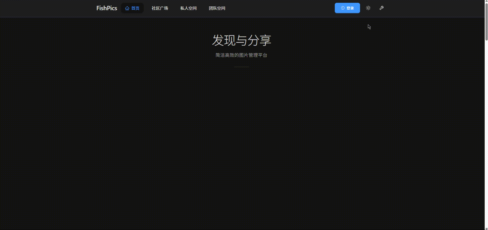
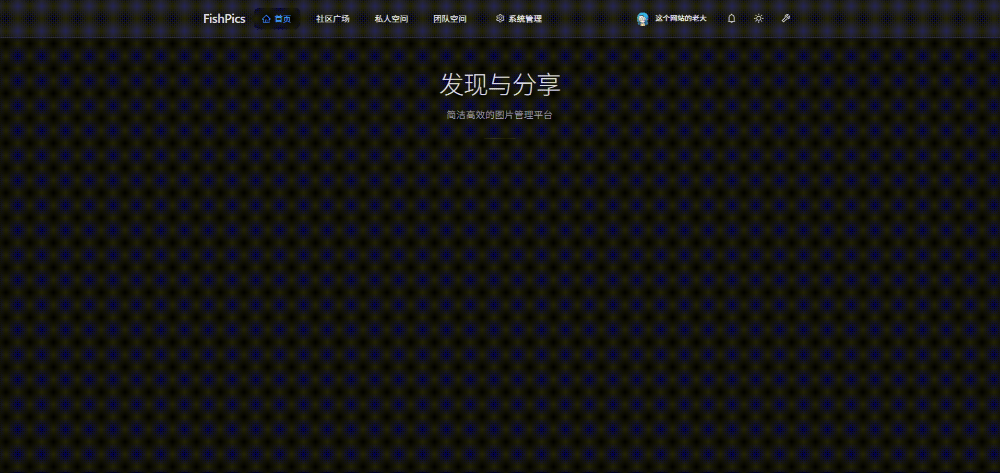
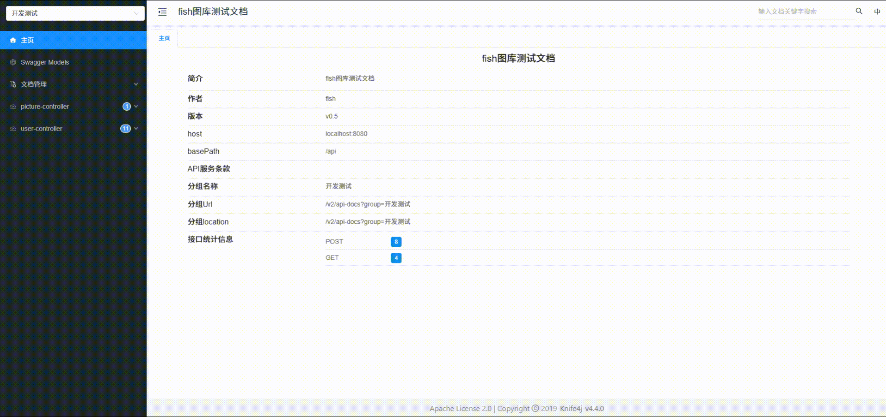

# AI.Image.Material.Collaboration.Platform

<div align="center">

           

[GitHub](https://github.com/FishDuM/AI.Image.Material.Collaboration.Platform) | [Gitee](https://gitee.com/dumhfdy/AI.Image.Material.Collaboration.Platform) | [头歌](https://code.educoder.net/pfqxsyecz/AI.Image.Material.Collaboration.Platform)

</div>

**FishPics** 是一个基于 React 19 + Spring Boot 的图片分享与互动社区平台，采用前后端分离架构，提供图片管理、社区互动、团队协作、AI 素材管理等核心功能。平台支持用户注册登录、图片浏览管理、帖子发布与编辑、评论互动、分类标签浏览、团队空间协作、后台审核管理等能力，社区广场采用瀑布流布局与小红书风格的帖子详情弹窗，致力于打造简洁高效、安全可靠的图片内容生态。

---

## 项目特色

- 美观流畅的前端界面，支持 PC / 移动端自适应
- 完整的图片生态：上传、查看、收藏、评论、点赞、关注
- 安全可靠的用户体系：登录注册、权限控制、图形验证码防护
- 高性能架构：Session + Redis 会话管理、用户信息缓存、系统配置缓存、MyBatis-Plus 分页查询
- 明暗主题切换，个性化用户体验
- 多空间管理：个人空间、团队空间、社区广场、图片关联空间
- 社区广场：瀑布流布局、分类标签筛选、帖子发布与编辑、小红书风格详情弹窗、图片轮播、滚动隐藏导航栏
- 图片管理：图片上传审核、管理员批量审核、公开图片列表、图片关联空间
- 系统管理：分类标签管理（Redis 缓存）、跑马灯图片管理（Redis 缓存）
- 管理员后台：用户管理、图片管理、系统管理、空间管理、团队管理、AI 管理、权限控制
- 腾讯云 COS 对象存储服务，支持海量图片存储
- Redisson 分布式锁，支持并发安全操作

---

## 技术栈

### 前端 (FishPic-frontend)

- **React 19** + **Vite 8** + **Ant Design 6 组件库**
- **React Router v7** 路由管理与路由守卫
- **Context API** 状态管理 (AuthContext、ThemeContext)
- **dayjs** 日期处理
- **Axios** 请求封装（拦截器、统一错误处理）
- 响应式布局 / 美观 UI
- ESLint 代码规范检查

### 后端 (FishPics-backend)

- **Spring Boot 2.7.6**
- **Java 11**
- **Spring Session + Redis** 会话管理（Session 存储 userId，Redis 缓存 User 信息）
- **Redisson** 分布式锁
- **MyBatis-Plus 3.5.15** ORM框架 + 分页插件
- **MySQL 8+** 关系型数据库
- **Redis** 验证码存储、会话管理、用户信息缓存、系统配置缓存
- **Knife4j 4.4.0** API文档生成
- **Hutool 5.8.38** 工具库
- **Lombok** 简化代码
- **AOP** 注解式权限拦截 (AuthCheck)
- **腾讯云 COS 5.6.227** 对象存储服务

---

## 效果预览

- **首页**：登录/注册界面，带图形验证码
  
- **用户管理**：管理员后台，支持查询、编辑、封禁/解封用户
  
- **API 文档**：Knife4j 自动生成的接口文档
  

---

## 核心功能

### 用户模块

- 用户注册登录，支持图形验证码防护
- 用户信息管理，支持修改头像、昵称、邮箱、手机号
- 隐私设置：关注列表、粉丝列表、点赞/收藏列表可见性控制
- 权限控制，区分普通用户和管理员角色
- 退出登录，安全清除会话状态

### 图片管理模块

- 图片上传至腾讯云 COS 对象存储
- 图片信息记录，包含名称、URL、宽高、大小（字节）
- 头像上传，支持用户自定义头像
- 图片状态管控，支持正常、禁用、待审核状态（默认待审核）
- 公开性控制，支持图片是否公开到首页
- 图片审核，管理员可批量审核图片（通过/拒绝/标记精选）
- 公开图片列表，支持分页获取已审核通过的图片
- 图片关联空间，支持将图片归入指定空间管理
- 图片简介，支持为图片添加文字描述

### 帖子管理模块

- 帖子发布，支持标题、内容、多图片关联、封面选择、隐私设置
- 帖子编辑，支持修改标题、内容和图片
- 帖子浏览展示，瀑布流布局 + 小红书风格详情弹窗（左右分栏，左侧图片轮播，右侧内容与互动数据）
- 分类标签筛选，支持按标签分类浏览帖子
- 图片轮播，支持左右翻页与触摸滑动
- 帖子状态管控，支持正常、禁用、待审核、逻辑删除
- 隐私控制：公开、仅自己可见
- 统计数据：点赞数、收藏数、评论数、查看数、热度值
- 我的帖子列表，分页获取当前用户发布的帖子
- 我的收藏列表，分页获取当前用户收藏的帖子
- 我的点赞列表，分页获取当前用户点赞的帖子
- 图片上传支持最多 15 张，格式校验（JPEG、PNG、GIF、WebP、HEIC），单张不超过 5MB

### 评论互动模块

- 帖子评论，支持用户发表评论内容
- 二级评论 / 回复功能，支持回复指定用户
- 评论状态管控，支持正常、禁用、待审核状态

### 收藏与点赞模块

- 帖子收藏，支持用户收藏感兴趣的帖子
- 帖子点赞，支持用户为帖子点赞
- 状态管理，支持取消收藏和取消点赞

### 社交互动模块

- 用户关注，支持关注/取消关注操作
- 粉丝管理，查看粉丝列表和关注列表
- 隐私控制，用户可设置关注/粉丝列表是否公开

### 空间管理模块

- 个人空间，管理个人图片与帖子内容
- 团队空间，支持团队协作与共享素材
- 社区广场，瀑布流展示所有公开帖子，支持分类标签筛选、发帖、编辑、帖子详情浏览
- 空间创建，支持管理员创建私有空间（默认 512MB）和团队空间（默认 5GB）
- 空间配置，支持空间名称、介绍、类型、级别、存储大小管理
- 空间图片列表，分页查看指定空间内的图片
- 跑马灯展示，首页轮播展示跑马灯图片
- 消息通知，支持评论互动、赞和收藏、新增关注、系统通知、私信五个分类

### 系统管理模块

- 分类标签管理，支持添加、删除图片分类标签（Redis 缓存加速）
- 跑马灯图片管理，支持添加、删除跑马灯图片（Redis 缓存加速）
- 系统配置存储在 pic_system 表，键值对格式，支持 JSON 数组
- 配置优先从 Redis 读取，未命中时查数据库并回写缓存

### 后台管理模块

- 用户管理，支持查询、编辑、封禁/解封用户
- 多维度搜索，支持按 ID、用户名、手机号、昵称、角色、状态筛选
- 图片管理，支持查看、审核（通过/拒绝/精选）、删除图片
- 空间管理，后台统一管理所有空间
- 团队管理，后台统一管理所有团队（开发中）
- AI 素材管理，后台管理 AI 相关素材（开发中）
- 权限控制，基于 AOP 注解实现管理员权限拦截

---

## 数据库设计

### 表结构

- **user**: 用户表，包含用户基本信息、权限、状态、隐私设置、用户级别、已用存储大小（账号、密码、头像、邮箱、手机号、昵称、角色、隐私开关、level、size）
- **picture**: 图片表，记录图片信息和关联用户与空间（名称、URL、宽高、大小、状态、公开性、帖子关联、空间关联、图片简介）
- **post**: 帖子表，管理帖子内容、统计数据、隐私设置和热度值（标题、内容、状态、点赞/收藏/评论/查看数、封面、热度值）
- **comment**: 评论表，记录用户评论和回复关系（内容、父评论、回复目标用户、状态）
- **space**: 空间表，管理私有空间和团队空间（名称、介绍、类型、级别、存储大小、已用大小、团队成员）
- **pic_system**: 系统配置表，存储分类标签和跑马灯图片等系统配置（键值对格式，JSON 存储）
- **user_post_collect**: 用户帖子收藏表
- **user_post_likes**: 用户帖子点赞表
- **user_fans**: 用户粉丝关系表

### 索引优化

- 用户表：用户名和昵称唯一索引
- 图片表：用户 ID、图片名称索引、空间 ID 索引、简介索引、更新时间索引
- 帖子表：用户 ID、标题索引、内容前缀索引、状态索引
- 评论表：用户 ID 和帖子 ID 索引
- 空间表：用户 ID 索引、类型索引
- 系统配置表：syskey 唯一索引
- 粉丝表：用户 ID 和粉丝 ID 联合索引

---

## 项目结构

### 前端项目 (FishPic-frontend)

```
src/
├── api/               # API 请求封装
├── assets/            # 前端静态资源
├── components/        # 公共组件 (ErrorBoundary, FunnyBackground, GlobalLayout, ProtectedRoute, PostDetailModal, CreateEditPostModal)
├── context/           # 状态管理 (AuthContext, ThemeContext)
├── pages/             # 页面组件 (HomePage, UserProfile, CommunitySquare, PrivateSpace, TeamSpace, Notifications, AdminUserList, AdminPictureManagement, SystemManagement, UserManagement, NotFound 等)
├── utils/             # 工具函数 (storage.js)
├── App.jsx            # 路由配置
└── main.jsx           # 应用入口
```

### 后端项目 (FishPics-backend)

```
hk.ljx.fishpicsbackend/
├── common/
│   ├── annotation/    # 权限检查注解 (AuthCheck)
│   ├── aop/           # 权限拦截器 (AuthInterceptor)
│   ├── config/        # 跨域、COS、JSON、MyBatis Plus、Session Redis 等配置类
│   ├── constants/     # Redis、用户、空间、系统配置相关常量定义
│   ├── exception/     # 自定义异常、异常码、全局异常处理器
│   ├── response/      # 统一响应封装工具
│   └── utils/         # 工具类（受限输入流）
├── controller/        # 控制器（用户、帖子、图片、空间、系统接口）
├── dto/
│   ├── base/          # 基础请求参数（删除、分页）
│   ├── picture/       # 图片消息、批量删除数据传输对象
│   ├── post/          # 帖子编辑、查询、上传请求参数
│   ├── space/         # 空间创建、更新、查询、图片列表请求参数
│   ├── system/        # 系统标签、跑马灯添加请求参数
│   └── user/          # 用户编辑、登录、查询请求参数
├── entity/            # 数据库实体类（评论、图片、帖子、用户、空间、系统配置、粉丝、收藏、点赞）
├── enums/             # 用户角色枚举
├── mapper/            # MyBatis Plus 数据访问层接口（含 SpaceMapper、PicSystemMapper）
├── service/
│   ├── impl/          # 业务逻辑接口实现类
│   └── LoginUser.java # 登录用户获取工具（Session + Redis）
└── vo/
    ├── picture/       # 图片视图对象（上传响应、管理员视图、列表、分页）
    ├── post/          # 帖子详情和列表视图对象
    └── user/          # 验证码、登录、用户信息视图对象
```

---

## 快速启动

### 环境要求

- Java 11+
- Maven 3.6+
- MySQL 8+
- Redis 5.0+
- Node.js 18+
- npm 9+ 或 yarn

### 后端启动

1. 创建 MySQL 数据库 `FishPics`，执行 `src/sql/create.sql` 脚本初始化表结构
2. 修改 `src/main/resources/application.yml` 中的数据库和 Redis 连接信息
3. 配置腾讯云 COS 信息（默认注释状态）
4. 启动 Spring Boot 应用（运行 `FishPicsBackendApplication.java`）
5. 访问 API 文档：`http://localhost:8080/api/doc.html`

### 前端启动

```bash
cd src/FishPic-frontend
npm install
npm run dev
```

### 访问应用

- 前端应用：`http://localhost:5173`
- 后端 API：`http://localhost:8080/api`
- API 文档：`http://localhost:8080/api/doc.html`

---

## 技术亮点

- **前后端分离架构**，职责清晰，易于维护
- **Session + Redis 认证**，Session 存储 userId，Redis 缓存 User JSON，仅需一次 Redis 查询获取用户，支持分布式部署
- **LoginUser 工具类**，统一封装从 Session 获取 userId、从 Redis 获取 User 对象的逻辑
- **图形验证码机制**，防止机器暴力破解
- **Redis 存储验证码**，验证码过期自动清理
- **Redis 系统配置缓存**，分类标签和跑马灯图片缓存在 Redis，减少数据库查询
- **AOP 注解式权限拦截**，基于 @AuthCheck 注解的细粒度权限控制
- **统一异常处理**，全局错误捕获和响应 (GlobalExceptionHandler)
- **统一响应格式**，规范的 API 返回 (Response\<T\>)
- **分页查询优化**，MyBatis-Plus 分页插件，大数据量处理高效
- **腾讯云 COS 对象存储**，海量图片存储
- **DTO/VO 分层设计**，数据传输与视图分离
- **隐私控制机制**，用户可自定义个人数据可见性
- **二级评论系统**，支持回复指定用户
- **帖子统计功能**，点赞数、收藏数、评论数、查看数、热度值实时统计
- **图片审核机制**，上传后默认待审核，管理员可批量审核通过/拒绝/标记精选
- **瀑布流布局**，Ant Design Masonry 组件实现响应式多列卡片展示
- **小红书风格弹窗**，左右分栏帖子详情/发帖弹窗，支持图片轮播与触摸滑动
- **滚动隐藏导航栏**，向下滚动自动隐藏顶部导航栏，向上滚动恢复显示
- **分类标签栏**，动态获取标签列表，sticky 固定在搜索栏下方
- **跑马灯轮播**，首页跑马灯图片轮播展示
- **明暗主题切换**，ThemeContext 状态管理，支持深色/浅色模式
- **错误边界组件**，前端异常优雅降级
- **路由保护组件**，基于角色的路由守卫 (ProtectedRoute)
- **Context API 状态管理**，AuthContext + ThemeContext 轻量级状态管理
- **Redisson 分布式锁**，支持并发安全操作

---

## 数据库设计详情

### 用户表 (user)

| 字段                    | 类型            | 说明                               |
| ----------------------- | --------------- | ---------------------------------- |
| id                      | bigint unsigned | 主键，自增                         |
| username                | varchar(32)     | 用户名（唯一）                     |
| password                | varchar(128)    | 密码                               |
| avatar                  | varchar(256)    | 头像 URL                           |
| email                   | varchar(64)     | 邮箱                               |
| phone                   | varchar(16)     | 手机号                             |
| nickname                | varchar(32)     | 昵称（唯一）                       |
| status                  | tinyint         | 状态：1-正常，0-禁用，2-待审核     |
| is_delete               | tinyint         | 逻辑删除：0-未删除，1-已删除       |
| role                    | varchar(32)     | 用户权限角色                       |
| like_num                | bigint          | 收到的点赞数                       |
| collect_num             | bigint          | 收藏数                             |
| is_private_follows      | tinyint         | 关注列表隐私：0-公开，1-不公开     |
| is_private_post_collect | tinyint         | 收藏帖子列表隐私：0-公开，1-不公开 |
| is_private_likes        | tinyint         | 点赞帖子列表隐私：0-公开，1-不公开 |
| is_private_fans         | tinyint         | 粉丝列表隐私：0-公开，1-不公开     |
| level                   | tinyint         | 用户级别：0-普通，1-VIP，2-SVIP    |
| size                    | bigint          | 已用存储大小（字节）               |
| create_time             | datetime        | 创建时间                           |
| update_time             | datetime        | 更新时间                           |

### 图片表 (picture)

| 字段         | 类型         | 说明                                   |
| ------------ | ------------ | -------------------------------------- |
| id           | bigint       | 主键，自增                             |
| user_id      | bigint       | 用户 ID                                |
| picture_name | bigint       | 图片名称                               |
| url          | varchar(512) | 图片地址                               |
| width        | varchar(32)  | 宽度                                   |
| height       | varchar(32)  | 高度                                   |
| size         | bigint       | 文件大小（字节）                       |
| status       | tinyint      | 状态：1-正常，0-禁用，2-待审核（默认） |
| is_private   | tinyint      | 公开性：0-不公开到首页，1-公开到首页   |
| post_id      | bigint       | 关联帖子 ID                            |
| space_id     | bigint       | 关联空间 ID                            |
| introduction | varchar(256) | 图片简介                               |
| create_time  | datetime     | 创建时间                               |
| update_time  | datetime     | 更新时间                               |

### 帖子表 (post)

| 字段         | 类型         | 说明                           |
| ------------ | ------------ | ------------------------------ |
| id           | bigint       | 主键，自增                     |
| user_id      | bigint       | 发帖用户 ID                    |
| title        | varchar(256) | 标题                           |
| content      | text         | 内容                           |
| status       | tinyint      | 状态：1-正常，0-禁用，2-待审核 |
| is_delete    | int          | 逻辑删除：0-未删除，1-已删除   |
| likes_num    | bigint       | 点赞数                         |
| collects_num | bigint       | 收藏数                         |
| comment_num  | int          | 评论数                         |
| views_num    | bigint       | 查看数                         |
| is_private   | tinyint      | 隐私：0-公开，1-仅自己可见     |
| cover        | bigint       | 封面图片 ID                    |
| hot          | decimal      | 热度值                         |
| create_time  | datetime     | 创建时间                       |
| update_time  | datetime     | 更新时间                       |

### 评论表 (comment)

| 字段        | 类型     | 说明                             |
| ----------- | -------- | -------------------------------- |
| id          | bigint   | 主键，自增                       |
| user_id     | bigint   | 评论用户 ID                      |
| post_id     | bigint   | 帖子 ID                          |
| content     | text     | 评论内容                         |
| parent_id   | bigint   | 父评论 ID（支持二级评论 / 回复） |
| to_user_id  | int      | 回复目标用户 ID                  |
| status      | tinyint  | 状态：1-正常，0-禁用，2-待审核   |
| create_time | datetime | 创建时间                         |

### 空间表 (space)

| 字段          | 类型          | 说明                             |
| ------------- | ------------- | -------------------------------- |
| id            | bigint        | 主键，自增                       |
| user_id       | bigint        | 创建者 ID                        |
| name          | varchar(246)  | 空间名称                         |
| introduction  | varchar(256)  | 空间介绍                         |
| type          | tinyint       | 空间类型：0-私有空间，1-团队空间 |
| level         | tinyint       | 空间级别：0-普通，1-VIP，2-SVIP  |
| storage_size  | bigint        | 空间存储大小（KB）               |
| size          | bigint        | 已用空间大小                     |
| team_users_id | varchar(1024) | 团队空间成员 ID 列表（JSON）     |

### 系统配置表 (pic_system)

| 字段     | 类型          | 说明                                          |
| -------- | ------------- | --------------------------------------------- |
| id       | bigint        | 主键，自增                                    |
| syskey   | varchar(256)  | 配置键（唯一，如 SYS_PIC_TYPE、SYS_MARQUEES） |
| sysvalue | varchar(1024) | 配置值（JSON 格式存储）                       |

---

## 安全设计

- **Session + Redis 认证**：Session 存储 userId，Redis 缓存 User 信息，支持分布式部署
- **LoginUser 工具类**：统一封装从 Session 和 Redis 获取当前用户的逻辑
- **图形验证码**：防止机器暴力破解
- **Redis 存储验证码**：验证码过期自动清理
- **AOP 权限拦截**：基于 @AuthCheck 注解的细粒度权限控制
- **逻辑删除**：数据安全，支持恢复
- **状态管理**：用户/内容状态控制，支持封禁/审核
- **图片审核**：上传后默认待审核，管理员审核后才公开
- **隐私控制**：用户可自定义个人数据可见性
- **文件上传限制**：受限输入流（LimitedInputStream）限制文件大小
- **Redisson 分布式锁**：防止并发操作冲突

---

## 开发规范

- 前端：ESLint 代码规范检查
- 后端：统一响应格式 `Response<T>`
- 异常处理：全局异常捕获，统一错误码
- 数据层：DTO/VO 分层设计，避免实体暴露
- 路由保护：基于角色的路由守卫 (ProtectedRoute)
- 状态管理：AuthContext + ThemeContext 集中管理状态
- 权限控制：基于 AOP 注解的管理员权限拦截
- 认证：LoginUser 工具类统一封装 Session + Redis 获取用户逻辑
- 缓存：系统配置优先从 Redis 读取，未命中时查数据库并回写缓存

---
