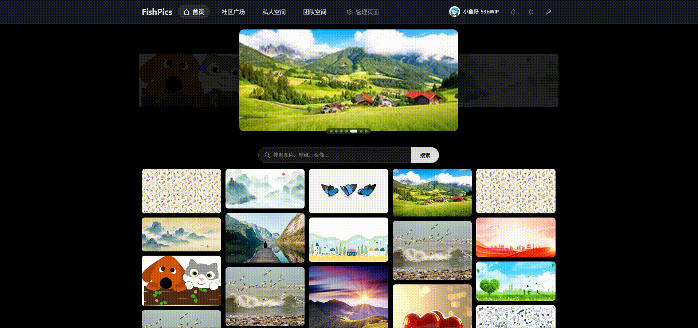
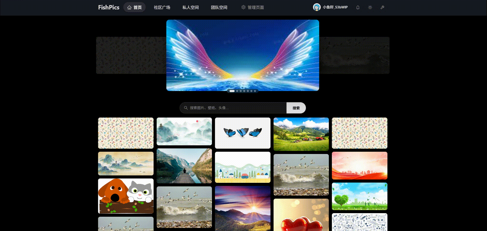
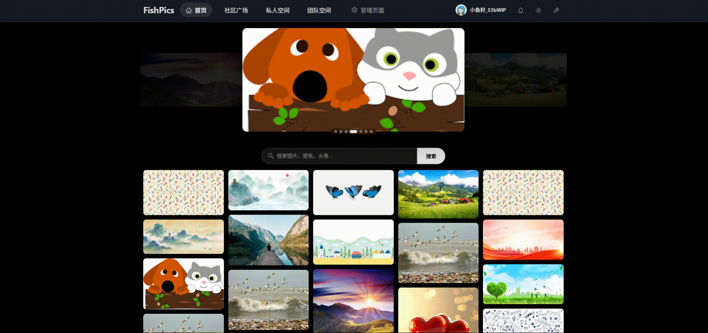
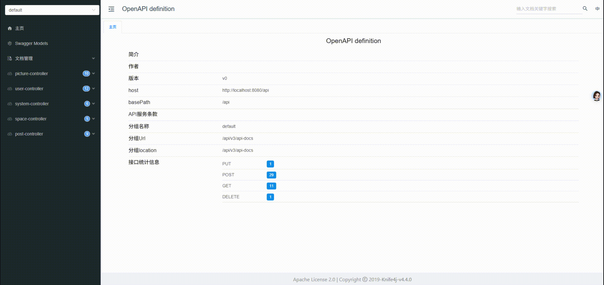

# AI.Image.Material.Collaboration.Platform

<div align="center">

           

[GitHub](https://github.com/FishDuM/AI.Image.Material.Collaboration.Platform) | [Gitee](https://gitee.com/dumhfdy/AI.Image.Material.Collaboration.Platform) | [头歌](https://code.educoder.net/pfqxsyecz/AI.Image.Material.Collaboration.Platform)

</div>

**FishPics** 是基于 React 19 + Spring Boot 3.2.5 的前后端分离图片分享与互动社区平台。支持用户注册登录、图片上传管理、帖子发布编辑、评论互动、分类标签浏览、团队空间协作、后台审核管理等，社区广场采用瀑布流布局与小红书风格帖子详情弹窗。

***

## 项目特色

- PC / 移动端自适应，独立移动端登录、注册、帖子、编辑页面
- Token + Redis 认证，AOP 注解式权限控制，图形验证码防护
- 瀑布流社区广场，分类标签筛选，小红书风格帖子详情弹窗
- 图片上传至腾讯云 COS，支持批量审核、分级上传限制、空间关联
- 个人空间 + 团队空间，分级存储配额（普通 512MB / VIP 5GB / SVIP 10GB）
- 管理员后台：用户管理、图片审核、系统配置、空间与团队管理
- Redisson 分布式锁保障点赞并发安全
- 明暗主题切换，系统配置 Redis 缓存

***

## 技术栈

### 前端 (FishPic-frontend)

- **React 19** + **Vite 8** + **Ant Design 6**
- **React Router v7** 路由管理与路由守卫
- **Context API** 状态管理（AuthContext、ThemeContext）
- **Axios** 请求封装（拦截器、统一错误处理、请求去重）
- **dayjs** 日期处理
- ESLint 代码规范检查

### 后端 (FishPics-backend)

- **Spring Boot 3.2.5**
- **Java 21**
- **Token + Redis 认证**（UUID Token 通过 Authorization 请求头传递，Redis 缓存 User 信息）
- **Redisson 3.27.0** 分布式锁
- **MyBatis-Plus 3.5.14** ORM框架 + 分页插件（mybatis-plus-spring-boot3-starter）
- **MySQL 8+** 关系型数据库
- **Redis** 验证码存储、Token 管理、用户信息缓存、系统配置缓存
- **Knife4j 4.4.0** API文档生成（OpenAPI3 Jakarta 版）
- **Hutool 5.8.38** 工具库
- **Lombok** 简化代码
- **AOP** 注解式权限拦截 (AuthCheck)
- **腾讯云 COS 5.6.227** 对象存储服务

***

## 效果预览

- **首页**：登录/注册界面，带图形验证码
  
- **用户管理**：管理员后台，支持查询、编辑、封禁/解封用户
  
- **社区广场**：帖子瀑布流展示，支持分类筛选与关键词搜索,图文内容展示，支持点赞、收藏、评论互动
  
- **移动端页面**：适配手机端的登录，明暗主题适配
  
- **空间管理**：支持私人空间与团队空间，满足不同协作场景
  
- **系统配置**：管理员后台跑马灯、分类标签管理
  
- **API 文档**：Knife4j 自动生成的接口文档
  
***

## 核心功能

### 用户模块

- 用户注册登录，支持图形验证码防护
- 用户信息管理，支持修改头像、昵称、邮箱、手机号
- 隐私设置：关注列表、粉丝列表、点赞/收藏列表可见性控制
- 权限控制，区分普通用户和管理员角色
- 退出登录，安全清除 Token 与用户状态

### 图片管理模块

- 图片上传至腾讯云 COS 对象存储
- 图片信息记录，包含名称、URL、宽高、大小（字节）
- 头像上传，支持用户自定义头像
- 图片状态管控，支持正常、禁用、待审核状态（默认待审核）
- 公开性控制，支持图片是否公开到首页
- 图片审核，管理员可批量审核图片（通过/拒绝/标记精选）
- 公开图片列表，支持分页获取已审核通过的图片
- 图片关联空间，支持将图片归入指定空间管理
- 图片简介，支持为图片添加文字描述
- 图片信息编辑，支持修改图片名称和介绍
- 分级上传限制，根据用户等级限制文件大小（普通3MB/VIP 5MB/SVIP 20MB）
- 空间存储检查，上传前检查私人空间是否充足
- 管理员上传自动通过审核

### 帖子管理模块

- 帖子发布，支持标题、内容、多图片关联、封面选择、隐私设置
- 帖子编辑，支持修改标题、内容和图片
- 帖子浏览展示，瀑布流布局 + 小红书风格详情弹窗（左右分栏，左侧图片轮播，右侧内容与互动数据）
- 分类标签筛选，支持按标签分类浏览帖子
- 图片轮播，支持左右翻页与触摸滑动
- 帖子状态管控，支持正常、禁用、待审核、逻辑删除
- 隐私控制：公开、仅自己可见
- 统计数据：点赞数、收藏数、评论数、查看数、热度值
- 热度排序公式：likes \* 0.3 + collects \* 0.3 + comments \* 0.2 + clicks \* 0.2
- 我的帖子列表，分页获取当前用户发布的帖子
- 我的收藏列表，分页获取当前用户收藏的帖子
- 我的点赞列表，分页获取当前用户点赞的帖子
- 图片上传支持最多 15 张，格式校验（JPEG、PNG、GIF、WebP、HEIC），单张大小限制 5MB
- 子图片关联表（picture\_child），支持图片排序
- 帖子图片列表同步过滤，getPost时pictureUrl与pictureIds同步过滤已删除图片

### 评论互动模块

- 帖子评论，支持用户发表评论内容
- 二级评论 / 回复功能，支持回复指定用户
- 评论状态管控，支持正常、禁用、待审核状态

### 收藏与点赞模块

- 帖子收藏，支持用户收藏感兴趣的帖子
- 帖子点赞，支持用户为帖子点赞
- 状态管理，支持取消\收藏和取消点赞

### 社交互动模块

- 用户关注，支持关注/取消关注操作
- 粉丝管理，查看粉丝列表和关注列表
- 隐私控制，用户可设置关注/粉丝列表是否公开

### 空间管理模块

- 个人空间，管理个人图片与帖子内容
- 团队空间，支持团队协作与共享素材
- 团队空间详情页，支持空间信息查看/编辑、图片瀑布流浏览/搜索/批量操作/编辑
- 社区广场，瀑布流展示所有公开帖子，支持分类标签筛选、发帖、编辑、帖子详情浏览、返回顶部（向下滚动100px后显示，平滑滚动）
- 空间创建，私人空间每人限1个（普通512MB/VIP 5GB/SVIP 10GB），团队空间按等级限制数量（普通1个/VIP 5个/SVIP 10个）
- 空间配置，支持空间名称、介绍、类型、级别、存储大小管理
- 空间详情查询，支持创建者或团队成员访问
- 空间图片列表，分页查看指定空间内的图片
- 跑马灯展示，首页轮播展示跑马灯图片
- 消息通知，支持评论互动、赞和收藏、新增关注、系统通知、私信五个分类
- VIP/SVIP会员体系，升级面板展示升级方案和增量包购买选项
- 存储空间卡片，圆形进度条展示使用率（超过90%红色警示）

### 系统管理模块

- 分类标签管理，支持添加、删除图片分类标签（Redis 缓存加速）
- 跑马灯图片管理，支持添加、删除跑马灯图片（Redis 缓存加速）
- 系统配置存储在 pic\_system 表，键值对格式，支持 JSON 数组
- 配置优先从 Redis 读取，未命中时查数据库并回写缓存

### 后台管理模块

- 用户管理，支持查询、编辑、封禁/解封用户
- 多维度搜索，支持按 ID、用户名、手机号、昵称、角色、状态筛选
- 图片管理，支持查看、审核（通过/拒绝/精选）、删除图片
- 空间管理，后台统一管理所有空间
- 团队管理，后台统一管理所有团队（开发中）
- AI 素\材管理，后台管理 AI 相关素材（开发中）
- 权限控制，基于 AOP 注解实现管理员权限拦截

***

## 数据库设计

### 表结构

- **user**: 用户表，包含用户基本信息、权限、状态、隐私设置、用户级别、已用存储大小（账号、密码、头像、邮箱、手机号、昵称、角色、隐私开关、level、size）
- **picture**: 图片表，记录图片信息和关联用户与空间（名称、URL、宽高、大小、状态、公开性、帖子关联、空间关联、图片简介）
- **post**: 帖子表，管理帖子内容、统计数据、隐私设置和热度值（标题、内容、状态、点赞/收藏/评论/查看数、封面、热度值）
- **comment**: 评论表，记录用户评论和回复关系（内容、父评论、回复目标用户、状态）
- **picture\_child**: 子图片关联表，记录帖子与图片的关联关系和排序（图片ID、帖子ID、排序序号）
- **space**: 空间表，管理私有空间和团队空间（名称、介绍、类型、级别、存储大小、已用大小、团队成员）
- **pic\_system**: 系统配置表，存储分类标签和跑马灯图片等系统配置（键值对格式，JSON 存储）
- **user\_post\_collect**: 用户帖子收藏表
- **user\_post\_likes**: 用户帖子点赞表
- **user\_fans**: 用户粉丝关系表

### 索引优化

- 用户表：用户名和昵称唯一索引
- 图片表：用户 ID、图片名称索引、空间 ID 索引、简介索引、更新时间索引
- 帖子表：用户 ID、标题索引、内容前缀索引、状态索引
- 评论表：用户 ID 和帖子 ID 索引
- 空间表：用户 ID 索引、类型索引
- 系统配置表：sys_key 唯一索引
- 粉丝表：用户 ID 和粉丝 ID 联合索引

***

## 项目结构

### 前端项目 (FishPic-frontend)

```
src/
├── api/               # API 请求封装（含请求去重机制）
├── assets/            # 前端静态资源
├── components/        # 公共组件
│   ├── shared/        # 共享组件（弹窗、卡片、导航栏等可复用 UI 组件）
│   └── 错误边界、全局布局、路由守卫、帖子弹窗等
├── context/           # 状态管理（认证上下文、主题上下文）
├── hooks/             # 自定义 Hooks（移动端检测、认证弹窗管理）
├── pages/             # 页面组件
│   ├── 桌面端页面（首页、社区、空间、管理后台等）
│   └── 移动端页面（登录、注册、帖子、编辑等独立页面）
├── styles/            # 全局样式（动画、轮播、共享样式）
├── utils/             # 工具函数（本地存储、上传约束）
├── App.jsx            # 路由配置（含移动端独立路由）
└── main.jsx           # 应用入口
```

### 后端项目 (FishPics-backend)

```
hk.ljx.fishpicsbackend/
├── common/
│   ├── annotation/        # 权限检查注解
│   ├── aop/               # 权限拦截切面
│   ├── config/            # 跨域、COS、JSON、MyBatis Plus 等配置类
│   ├── constants/         # Redis、用户、空间、系统配置相关常量定义
│   ├── exception/         # 自定义异常、异常码、全局异常处理器
│   ├── interceptor/       # Token 认证拦截器（刷新令牌拦截器、登录拦截器、MVC 配置）
│   ├── response/          # 统一响应封装工具
│   └── utils/             # 工具类（受限输入流、COS 服务、用户持有工具）
├── controller/            # 控制器（用户、帖子、图片、空间、系统接口）
├── dto/
│   ├── base/              # 基础请求参数（删除、分页）
│   ├── picture/           # 图片相关数据传输对象
│   ├── post/              # 帖子相关请求参数
│   ├── space/             # 空间相关请求参数
│   ├── system/            # 系统标签、跑马灯添加请求参数
│   └── user/              # 用户编辑、登录、查询请求参数
├── entity/                # 数据库实体类
├── enums/                 # 用户角色枚举
├── mapper/                # MyBatis Plus 数据访问层接口
├── service/
│   └── impl/              # 业务逻辑接口实现类
└── vo/
    ├── picture/           # 图片视图对象
    ├── post/              # 帖子详情和列表视图对象
    ├── space/             # 空间视图对象
    └── user/              # 验证码、登录、用户信息视图对象
```

***

## 快速启动

### 环境要求

- Java 21+
- Maven 3.6+
- MySQL 8+
- Redis 5.0+
- Node.js 18+
- npm 9+ 或 yarn

### 后端启动

1. 创建 MySQL 数据库 `FishPics`，执行 `src/sql/create.sql` 脚本初始化表结构
2. 修改 `src/main/resources/application.yml` 中的数据库和 Redis 连接信息
3. 配置腾讯云 COS 信息（默认注释状态）
4. 启动 Spring Boot 应用（运行 `FishPicsBackendApplication.java`）
5. 访问 API 文档：`http://localhost:8080/api/doc.html`

### 前端启动

```bash
cd src/FishPic-frontend
npm install
npm run dev
```

### 访问应用

- 前端应用：`http://localhost:5173`
- 后端 API：`http://localhost:8080/api`
- API 文档：`http://localhost:8080/api/doc.html`

***

## 技术亮点

- **前后端分离架构**，职责清晰，易于维护扩展
- **Token + Redis 认证**，UUID Token 通过 Authorization 头传递，支持分布式部署
- **RefreshTokenInterceptor + LoginInterceptor 双拦截器链**，请求级用户上下文注入
- **AOP 注解式权限拦截**，@AuthCheck 注解细粒度控制 admin/user 角色
- **统一响应格式** `Response<T>`，全局异常处理，规范错误码
- **MyBatis-Plus 分页插件**，大数据量高效分页
- **DTO/VO 分层设计**，数据传输与视图分离，避免实体暴露
- **Redisson 分布式锁**，点赞等并发操作安全
- **Axios 请求去重**，AbortController 自动取消重复请求

***

## 安全设计

- **Token + Redis 认证**：UUID Token 通过 Authorization 头传递，Redis 存储 Token，RefreshTokenInterceptor + LoginInterceptor 双拦截器链校验
- **UserHolder**：ThreadLocal 请求上下文，跨层传递用户信息
- **密码加密**：MD5 + 盐值
- **图形验证码**：Hutool CircleCaptcha，5 分钟有效，防暴力破解
- **AOP 权限拦截**：@AuthCheck 注解控制 admin/user 角色
- **逻辑删除**：数据可恢复
- **文件上传限制**：LimitedInputStream 限制文件大小
- **Redisson 分布式锁**：防并发冲突

***

## 开发规范

- 前端：ESLint 代码规范检查
- 后端：统一响应格式 `Response<T>`
- 异常处理：全局异常捕获，统一错误码
- 数据层：DTO/VO 分层设计，避免实体暴露
- 路由保护：基于角色的路由守卫 (ProtectedRoute)
- 状态管理：AuthContext + ThemeContext 集中管理状态
- 权限控制：基于 AOP 注解的管理员权限拦截
- 认证：Token + Redis 认证，RefreshTokenInterceptor + LoginInterceptor 拦截器链 + UserHolder ThreadLocal 工具类
- 缓存：系统配置优先从 Redis 读取，未命中时查数据库并回写缓存

***