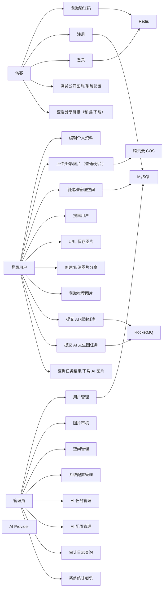
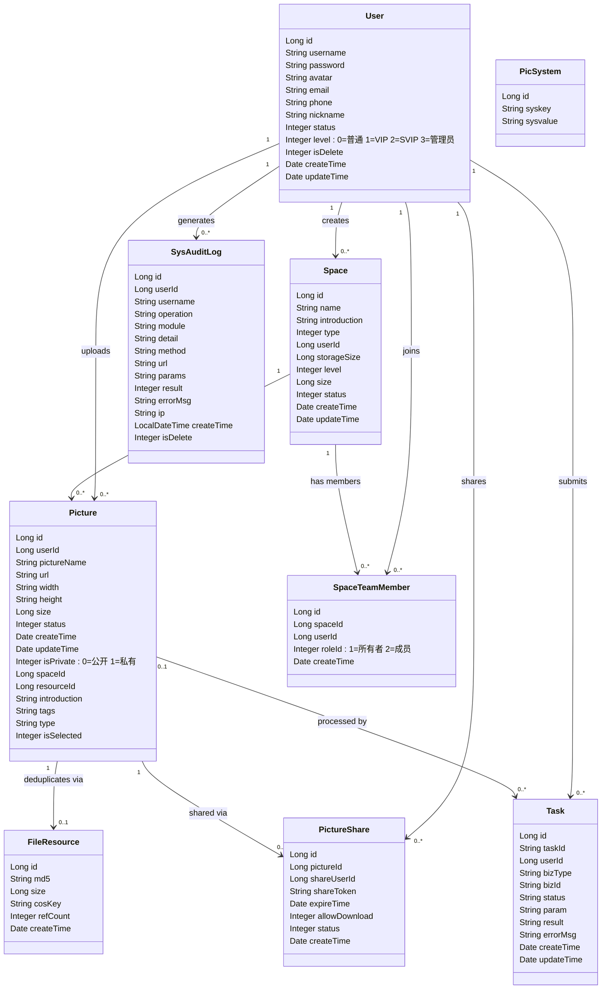
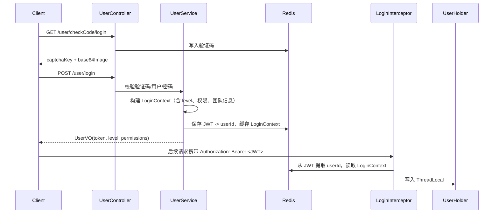
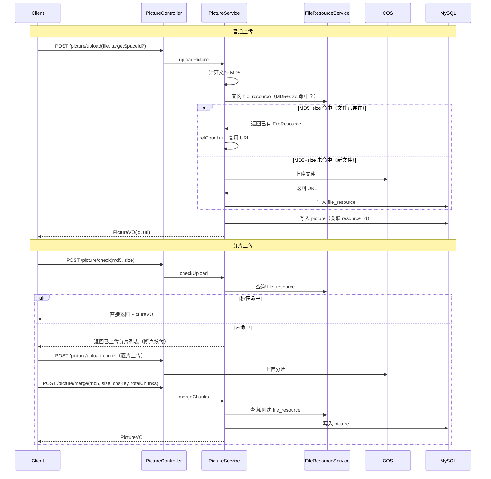
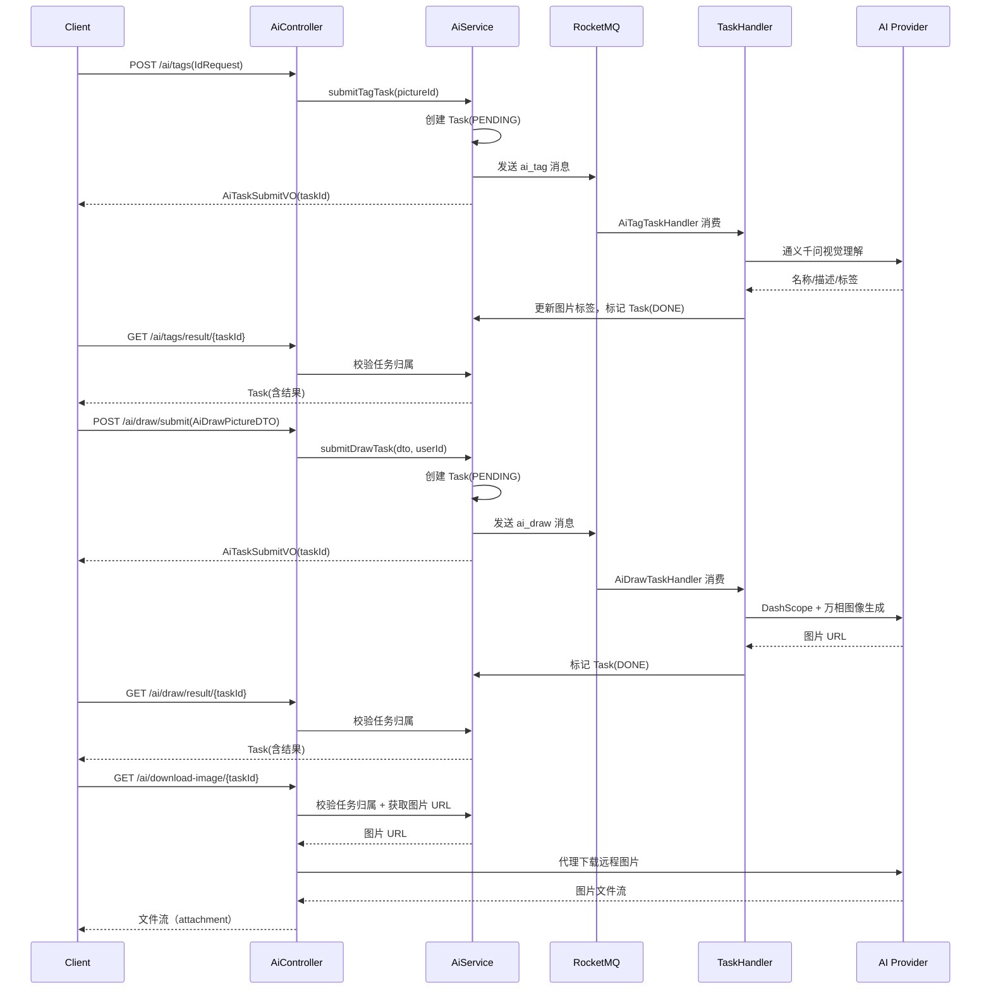
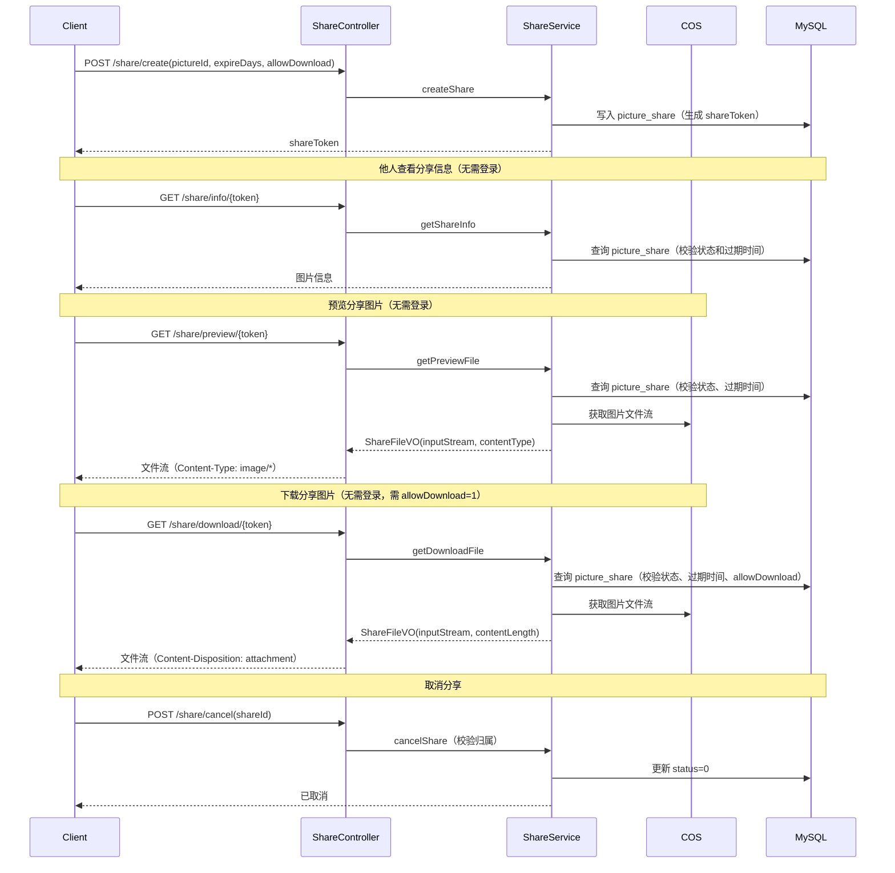
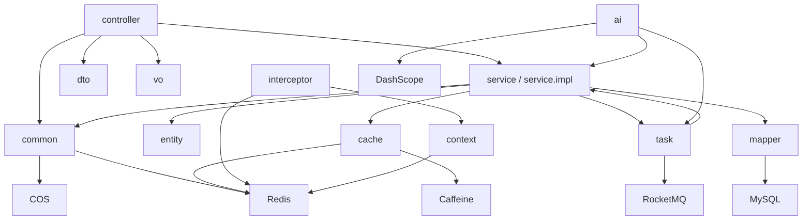

# FishPics 后端 UML 与数据模型

> 本文档基于当前 `src/FishPics-backend` 后端代码，描述参与者、用例、类结构、实体关系、请求流和 AI 任务流。
>
> 权限体系采用简化 RBAC：通过 `user.level` 字段（0=普通, 1=VIP, 2=SVIP, 3=管理员）控制功能分级，管理员接口通过 `@RequireAdmin` 注解（`level >= 3`）守卫。

## 1. 用例模型

### 1.1 参与者

| 参与者 | 说明 |
| --- | --- |
| 访客 | 可查看公开配置、获取验证码、注册、登录、浏览公开图片、查看分享链接（含预览/下载） |
| 登录用户 | 可维护个人资料、上传图片、管理空间、分享图片、搜索用户、使用 AI 标注和文生图 |
| 管理员 | 可管理用户、图片、空间、系统配置、AI 任务和配置、审计日志（`level >= 3`） |
| AI Provider | DashScope / 阿里云模型服务，执行视觉理解和图像生成 |
| COS 对象存储 | 保存头像和图片文件（支持分片上传与文件去重） |
| Redis | 保存验证码、JWT 黑名单、登录上下文缓存 |
| Caffeine | 本地缓存 L1 |
| MySQL | 保存业务主数据 |
| RocketMQ | 异步任务消息队列 |

### 1.2 用例图



### 1.3 权限矩阵

| 模块 | 访客 | 登录用户 | 管理员 |
| --- | --- | --- | --- |
| 验证码、注册、登录 | 是 | 是 | 是 |
| 公开图片列表、系统配置查询 | 是 | 是 | 是 |
| 查看分享链接（含预览/下载，无需登录） | 是 | 是 | 是 |
| 当前用户、资料、退出 | 否 | 是 | 是 |
| 上传图片、空间管理、图片编辑、分享 | 否 | 是 | 是 |
| 推荐图片 | 否 | 是 | 是 |
| AI 标注/文生图任务、查询结果、下载 AI 图片 | 否 | 是 | 是 |
| 后台管理接口（用户、图片、空间、系统） | 否 | 否 | 是 |
| AI 后台管理（任务列表、统计、配置） | 否 | 否 | 是 |
| 审计日志、系统统计 | 否 | 否 | 是 |

> 管理员判定：`@RequireAdmin` 注解检查 `user.level >= 3`。
> AI 接口仅要求登录（`LoginInterceptor` 拦截），代码中无 `level >= 1` 校验。

## 2. 领域类图



## 3. 数据库 ER 图

```mermaid
erDiagram
    USER ||--o{ SPACE : creates
    USER ||--o{ PICTURE : uploads
    USER ||--o{ TASK : submits
    USER ||--o{ PICTURE_SHARE : shares
    USER ||--o{ SPACE_TEAM_MEMBER : joins
    USER ||--o{ SYS_AUDIT_LOG : generates

    SPACE ||--o{ PICTURE : stores
    SPACE ||--o{ SPACE_TEAM_MEMBER : has_members
    PICTURE ||--o| FILE_RESOURCE : deduplicates_via
    PICTURE ||--o{ PICTURE_SHARE : shared_via
    PICTURE ||--o{ TASK : processed_by

    USER {
        bigint id PK
        varchar username UK
        varchar password
        varchar avatar
        varchar email
        varchar phone
        varchar nickname UK
        tinyint status
        tinyint level
        tinyint is_delete
        datetime create_time
        datetime update_time
    }

    SPACE {
        bigint id PK
        varchar name
        varchar introduction
        tinyint type
        bigint user_id FK
        bigint storage_size
        tinyint level
        bigint size
        tinyint status
        datetime create_time
        datetime update_time
    }

    PICTURE {
        bigint id PK
        bigint user_id FK
        varchar picture_name
        varchar url
        varchar width
        varchar height
        bigint size
        tinyint status
        datetime create_time
        datetime update_time
        tinyint is_private : "0=公开 1=私有"
        bigint space_id FK
        bigint resource_id FK
        varchar introduction
        varchar tags
        varchar type
        tinyint is_selected
    }

    FILE_RESOURCE {
        bigint id PK
        varchar md5
        bigint size
        varchar cos_key
        int ref_count
        datetime create_time
    }

    PICTURE_SHARE {
        bigint id PK
        bigint picture_id FK
        bigint share_user_id FK
        varchar share_token UK
        datetime expire_time
        tinyint allow_download
        tinyint status
        datetime create_time
    }

    PIC_SYSTEM {
        bigint id PK
        varchar syskey UK
        varchar sysvalue
    }

    TASK {
        bigint id PK
        varchar task_id UK
        bigint user_id FK
        varchar biz_type
        varchar biz_id
        varchar status
        text param
        text result
        text error_msg
        datetime create_time
        datetime update_time
    }

    SPACE_TEAM_MEMBER {
        bigint id PK
        bigint space_id FK
        bigint user_id FK
        int role_id : "1=所有者 2=成员"
        datetime create_time
    }

    SYS_AUDIT_LOG {
        bigint id PK
        bigint user_id
        varchar username
        varchar operation
        varchar module
        varchar detail
        varchar method
        varchar url
        text params
        tinyint result
        varchar error_msg
        varchar ip
        datetime create_time
        tinyint is_delete
    }
```

> `FILE_RESOURCE` 表的唯一约束为 `(md5, size)` 组合，而非单独的 `md5`。

## 4. 控制器接口模型

### 4.1 UserController

| 方法 | 路径 | 入参 | 出参 | 权限 |
| --- | --- | --- | --- | --- |
| `POST` | `/user/login` | `UserLoginRequest` | `UserVO` | 公开 |
| `POST` | `/user/register` | `UserRequestRequest` | `Boolean` | 公开 |
| `GET` | `/user/checkCode/register` | - | `CheckCodeVO` | 公开 |
| `GET` | `/user/checkCode/login` | - | `CheckCodeVO` | 公开 |
| `GET` | `/user/myself` | - | `UserVO` | 登录 |
| `GET` | `/user/getUser` | - | `UserVO`（含 permissions） | 登录 |
| `POST` | `/user/editUser` | `UserEditRequest` | `Boolean` | 登录 |
| `POST` | `/user/logout` | `Authorization` | 空响应 | 登录 |
| `GET` | `/user/profile` | `userId` | `UserVO` | 公开 |
| `GET` | `/user/search` | `keyword` | `List<UserVO>` | 登录 |
| `POST` | `/user/admin/getUser` | `UserIdRequest` | `UserVO` | `@RequireAdmin` |
| `POST` | `/user/admin/userList` | `UserQueryWrapper` | `IPage<UserVO>` | `@RequireAdmin` |
| `POST` | `/user/admin/setStatus` | `UserIdRequest` | `Boolean` | `@RequireAdmin` |
| `POST` | `/user/admin/editUser` | `UserEditByAdminRequest` | `Boolean` | `@RequireAdmin` |

### 4.2 PictureController

| 方法 | 路径 | 入参 | 出参 | 权限 |
| --- | --- | --- | --- | --- |
| `POST` | `/picture/avatar` | `file`（必填）, `id`（可选，目标用户ID） | `String`（URL） | 登录 |
| `POST` | `/picture/upload` | `file,targetSpaceId?` | `PictureVO` | 登录 |
| `POST` | `/picture/save-by-url` | `SavePictureByUrlRequest` | `PictureVO` | 登录 |
| `POST` | `/picture/list` | `PictureQueryRequest` | `IPage<PictureVO>` | 公开 |
| `POST` | `/picture/recommend` | `PageRequest` | `IPage<PictureVO>` | 登录 |
| `POST` | `/picture/delete` | `DeleteByIdList` | `String` | 登录 |
| `PUT` | `/picture/update` | `PictureUpdateRequest` | `Boolean` | 登录 |
| `GET` | `/picture/pictureEditMessage` | `id` | `PictureVO` | 登录 |
| `POST` | `/picture/check` | `CheckUploadRequest` | 秒传校验结果 | 登录 |
| `POST` | `/picture/upload-chunk` | `file,md5,chunkIndex` | 分片上传结果 | 登录 |
| `POST` | `/picture/merge` | `MergeChunksRequest` | `PictureVO` | 登录 |
| `POST` | `/picture/admin/list` | `AdminPictureListDTO` | `IPage<PictureVO>` | `@RequireAdmin` |
| `POST` | `/picture/admin/review` | `ReviewPictureDTO` | `Boolean` | `@RequireAdmin` |

### 4.3 ShareController

| 方法 | 路径 | 入参 | 出参 | 权限 |
| --- | --- | --- | --- | --- |
| `POST` | `/share/create` | `ShareCreateRequest` | `String`（shareToken） | 登录 |
| `GET` | `/share/info/{token}` | `token` | `Map`（分享信息） | 公开 |
| `GET` | `/share/preview/{token}` | `token` | 文件流（Content-Type: image/*） | 公开 |
| `GET` | `/share/download/{token}` | `token` | 文件流（attachment） | 公开 |
| `POST` | `/share/cancel` | `ShareCancelRequest` | `Boolean` | 登录 |

> `/share/preview/*`、`/share/download/*` 在 `TokenRefreshInterceptor` 和 `LoginInterceptor` 中均被排除，无需登录。
> 预览仅允许 `image/*` Content-Type，非图片类型降级为 `application/octet-stream`。
> 下载时文件名通过 `Content-Disposition` 头指定，UTF-8 编码。

### 4.4 SpaceController

| 方法 | 路径 | 入参 | 出参 | 权限 |
| --- | --- | --- | --- | --- |
| `POST` | `/space/create` | `CreateSpace` | `Boolean` | 登录 |
| `GET` | `/space/list` | `type` | `List<SpaceVO>` | 登录 |
| `GET` | `/space/getSpace` | `id` | `SpaceVO` | 登录/成员 |
| `POST` | `/space/update` | `UpdateSpace` | `Boolean` | 拥有者/管理员 |
| `POST` | `/space/pictureList` | `SpacePictureList`（含 `spaceId`, `keyword`, `sortField`, `sortOrder`, `current`, `pageSize`） | `PicturePageVO` | 登录/成员 |
| `GET` | `/space/saveable` | - | `List<SpaceVO>` | 登录 |
| `GET` | `/space/team/members` | `spaceId` | `List<SpaceMemberVO>` | 登录/成员 |
| `POST` | `/space/team/invite` | `TeamInviteRequest` | `Boolean` | 登录 |
| `POST` | `/space/team/remove` | `TeamRemoveRequest` | `Boolean` | 登录 |
| `POST` | `/space/team/changeRole` | `TeamChangeRoleRequest` | `Boolean` | 登录 |
| `POST` | `/space/admin/list` | `SpaceQueryWrapper` | `IPage<SpaceVO>` | `@RequireAdmin` |
| `POST` | `/space/admin/update` | `SpaceAdminUpdateRequest` | `Boolean` | `@RequireAdmin` |
| `POST` | `/space/admin/delete` | `SpaceDeleteRequest` | `Boolean` | `@RequireAdmin` |
| `POST` | `/space/admin/setStatus` | `SpaceSetStatusRequest` | `Boolean` | `@RequireAdmin` |

### 4.5 SystemController

| 方法 | 路径 | 入参 | 出参 | 权限 |
| --- | --- | --- | --- | --- |
| `GET` | `/system/list` | - | `List<String>` | 公开 |
| `POST` | `/system/addList` | `AddSysPicType` | `Boolean` | `@RequireAdmin` |
| `POST` | `/system/deleteType` | `DeleteTypeRequest` | `Boolean` | `@RequireAdmin` |
| `GET` | `/system/marquee` | - | `List<String>` | 公开 |
| `POST` | `/system/addMarquee` | `AddSysMarquee` | `Boolean` | `@RequireAdmin` |
| `POST` | `/system/deleteMarquee` | `DeleteMarqueeRequest` | `Boolean` | `@RequireAdmin` |

### 4.6 AuditLogController

| 方法 | 路径 | 入参 | 出参 | 权限 |
| --- | --- | --- | --- | --- |
| `POST` | `/system/audit-log/list` | `AuditLogQueryRequest` | `IPage<SysAuditLog>` | `@RequireAdmin` |
| `GET` | `/system/stats` | - | `SystemStatsVO` | `@RequireAdmin` |

### 4.7 AiController

| 方法 | 路径 | 入参 | 出参 | 权限 |
| --- | --- | --- | --- | --- |
| `POST` | `/ai/tags` | `IdRequest` | `AiTaskSubmitVO` | 登录 |
| `GET` | `/ai/tags/result/{taskId}` | `taskId` | `Task` | 登录 |
| `POST` | `/ai/draw/submit` | `AiDrawPictureDTO` | `AiTaskSubmitVO` | 登录 |
| `GET` | `/ai/draw/result/{taskId}` | `taskId` | `Task` | 登录 |
| `GET` | `/ai/download-image/{taskId}` | `taskId` | 文件流（attachment） | 登录 |
| `POST` | `/ai/admin/tasks` | `AiTaskQueryDTO` | `IPage<AiTaskVO>` | `@RequireAdmin` |
| `GET` | `/ai/admin/stats` | - | `AiStatsVO` | `@RequireAdmin` |
| `GET` | `/ai/admin/config` | - | `AiConfigDTO` | `@RequireAdmin` |
| `POST` | `/ai/admin/config` | `AiConfigDTO` | `Boolean` | `@RequireAdmin` |

> AI 能力采用异步任务模式，任务通过 RocketMQ 消费，结果持久化在 `task` 表中。
> `/ai/tags/result`、`/ai/draw/result`、`/ai/download-image` 会校验任务归属，仅允许发起者操作自己的任务。
> `/ai/download-image` 从 AI 结果中获取图片 URL 并代理下载，限制最大 50MB。

## 5. 关键流程图

### 5.1 登录鉴权流程



### 5.2 图片上传流程（含分片上传与文件去重）



### 5.3 AI 调用流程



### 5.4 图片分享流程



## 6. DTO/VO 模型摘要

### 6.1 主要请求 DTO

| DTO | 主要字段 | 使用场景 |
| --- | --- | --- |
| `UserLoginRequest` | `username, password, checkCode, captchaKey` | 登录 |
| `UserRequestRequest` | `username, password, checkPassword, checkCode, captchaKey` | 注册 |
| `UserEditRequest` | `id, username, password, originalPassword, email, phone, nickname` | 编辑本人资料 |
| `UserEditByAdminRequest` | `id, username, password, email, phone, nickname, level` | 管理员编辑用户 |
| `UserQueryWrapper` | 用户筛选与分页字段 | 后台用户查询 |
| `UserIdRequest` | `userId` | 用户ID查询 |
| `PictureQueryRequest` | `tag, current, pageSize` | 图片列表查询 |
| `PictureUpdateRequest` | `id, pictureName, introduction, tags` | 图片信息编辑 |
| `DeleteByIdList` | `ids` | 批量删除图片 |
| `SavePictureByUrlRequest` | `url, targetSpaceId` | URL 保存图片 |
| `CheckUploadRequest` | `md5, size, targetSpaceId` | 秒传校验 |
| `MergeChunksRequest` | `md5, size, cosKey, totalChunks, targetSpaceId` | 合并分片 |
| `AdminPictureListDTO` | `status, current, pageSize` | 管理员图片列表 |
| `ReviewPictureDTO` | `pictureId, status, selected` | 管理员审核图片 |
| `ShareCreateRequest` | `pictureId, expireDays, allowDownload` | 创建分享 |
| `ShareCancelRequest` | `shareId` | 取消分享 |
| `CreateSpace` | `name, introduction, type` | 创建空间 |
| `UpdateSpace` | `id, name, introduction` | 更新空间 |
| `SpacePictureList` | `spaceId, keyword, sortField, sortOrder, current, pageSize` | 空间图片列表 |
| `SpaceQueryWrapper` | 空间筛选与分页 | 后台空间列表 |
| `SpaceAdminUpdateRequest` | 空间后台可改字段 | 后台空间编辑 |
| `SpaceDeleteRequest` | `id` | 后台删除空间 |
| `SpaceSetStatusRequest` | `id, status` | 后台设置空间状态 |
| `TeamInviteRequest` | `spaceId, userId, roleId` | 邀请团队成员 |
| `TeamRemoveRequest` | `spaceId, userId` | 移除团队成员 |
| `TeamChangeRoleRequest` | `spaceId, userId, roleId` | 变更团队角色 |
| `AddSysPicType` | `value` | 添加分类标签 |
| `AddSysMarquee` | `url` | 添加跑马灯 |
| `DeleteTypeRequest` | `value` | 删除分类标签 |
| `DeleteMarqueeRequest` | `url` | 删除跑马灯 |
| `AuditLogQueryRequest` | `current, pageSize, sortField, sortOrder, operation, module, result, username` | 审计日志查询 |
| `AiDrawPictureDTO` | `description, exclusion, style, size` | AI 文生图 |
| `AiTaskQueryDTO` | `type, status, current, pageSize` | AI 任务查询 |
| `AiConfigDTO` | `taggingEnabled, editingEnabled, generationEnabled, recommendationEnabled` | AI 功能配置 |
| `IdRequest` | `id` | 通用 ID 请求 |
| `PageRequest` | `current, pageSize, sortField, sortOrder` | 通用分页查询 |

### 6.2 主要响应 VO

| VO | 用途 |
| --- | --- |
| `UserVO` | 统一用户 VO（登录态、个人资料、公开主页、搜索结果、管理员查看等场景复用） |
| `CheckCodeVO` | 验证码图片与 key |
| `PictureVO` | 统一图片 VO（列表、详情、编辑、上传、管理员查看等场景复用） |
| `PicturePageVO` | 空间图片分页（records + total） |
| `SpaceVO` | 空间展示项（含图片数、成员列表） |
| `SpaceMemberVO` | 团队成员展示项（id, nickname, avatar, roleId, roleName） |
| `ShareFileVO` | 分享文件流（pictureName, contentType, contentLength, inputStream）；实现 AutoCloseable |
| `SystemStatsVO` | 系统统计概览（totalUsers, totalPictures, totalSpaces, todayNewUsers, todayNewPictures） |
| `AiPictureMessage` | AI 标注结果（名称、描述、标签列表） |
| `AiTaskSubmitVO` | AI 任务提交返回（taskId, status） |
| `AiTaskVO` | AI 任务详情（管理后台） |
| `AiStatsVO` | AI 任务统计（管理后台） |

## 7. 状态与约束

### 7.1 状态字段

| 模型 | 字段 | 值 |
| --- | --- | --- |
| `User` | `status` | `1` 正常，`0` 禁用 |
| `User` | `level` | `0` 普通，`1` VIP，`2` SVIP，`3` 管理员 |
| `Picture` | `status` | `1` 正常，`0` 禁用，`2` 待审核 |
| `Picture` | `isPrivate` | `0` 公开，`1` 私有 |
| `Picture` | `isSelected` | `0` 普通，`1` 精选 |
| `Space` | `status` | `1` 正常，`0` 禁用 |
| `Space` | `type` | `0` 私人空间，`1` 团队空间 |
| `SpaceTeamMember` | `roleId` | `1` 所有者，`2` 成员 |
| `PictureShare` | `status` | `1` 有效，`0` 已取消 |
| `Task` | `status` | `PENDING` 待处理，`PROCESSING` 处理中，`DONE` 成功，`FAILED` 失败 |
| `Task` | `bizType` | `ai_tag` 标注任务，`ai_draw` 文生图任务 |

### 7.2 关键约束

- `user.username`、`user.nickname` 唯一。
- `pic_system.syskey` 唯一。
- `file_resource` 唯一约束为 `(md5, size)` 组合，用于文件去重（同一 MD5 但不同 size 视为不同文件）。
- `picture_share.share_token` 唯一。
- `task.task_id` 唯一索引。
- `space_team_member(space_id, user_id)` 唯一约束，同一用户在同一空间只能有一个角色。
- `picture.resource_id` 关联 `file_resource.id`，实现文件级去重。
- `file_resource.ref_count` 记录引用计数，删除图片时递减，归零时可清理物理文件（`CHECK (ref_count >= 0)`）。
- `picture.tags` 存储 AI 标签，逗号分隔（如 `人物,风景`）。
- `picture.is_private` 语义：`0` 公开，`1` 私有。
- `picture.is_selected` 精选标记，管理员审核时可设置。
- 管理员接口通过 `@RequireAdmin` 注解守卫，要求 `level >= 3`。
- AI 接口仅要求登录，代码中无 `level >= 1` 校验。
- 登录鉴权采用 JWT + Redis 方案：登录时签发 JWT，拦截器从 JWT 提取 userId，从 Redis 读取 `LoginContext`（含 level、权限、团队信息）写入 ThreadLocal。
- 登出时将 JWT 加入 Redis 黑名单。
- 分片上传流程：秒传校验（MD5+size） -> 分片上传 -> 合并分片，通过 `file_resource` 表实现跨文件去重。
- 分享链接支持过期时间控制和下载权限控制（`allow_download`），预览/下载接口无需登录。
- 审计日志通过 `@AuditLog` 注解自动记录，包含操作模块、方法、URL、参数、IP 和用户信息。

## 8. 包依赖视图


