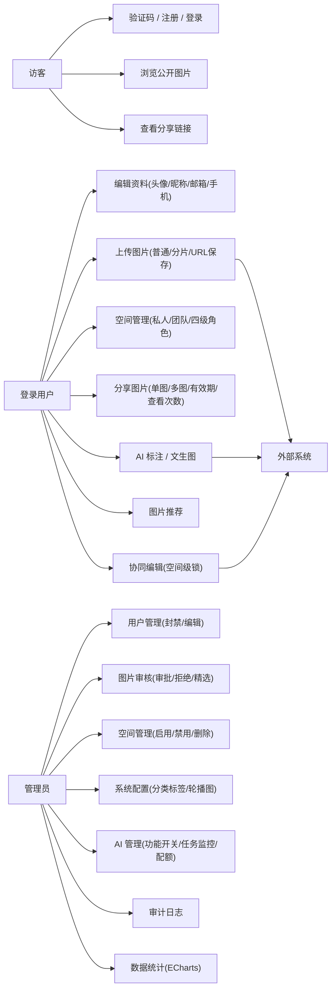
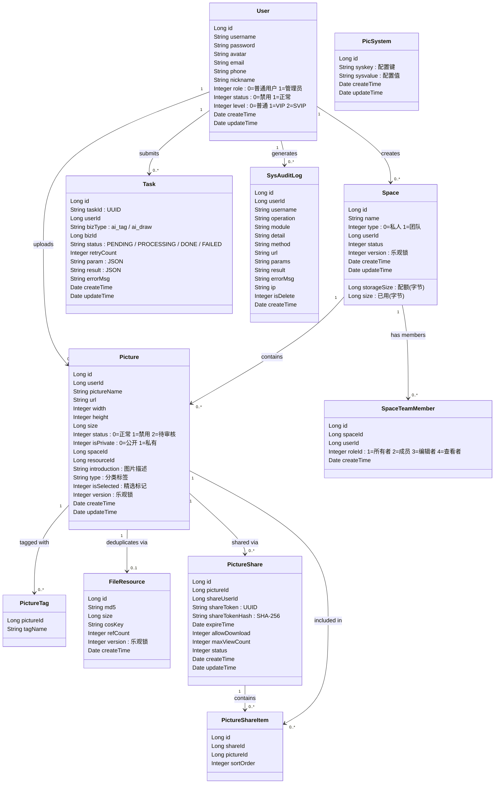
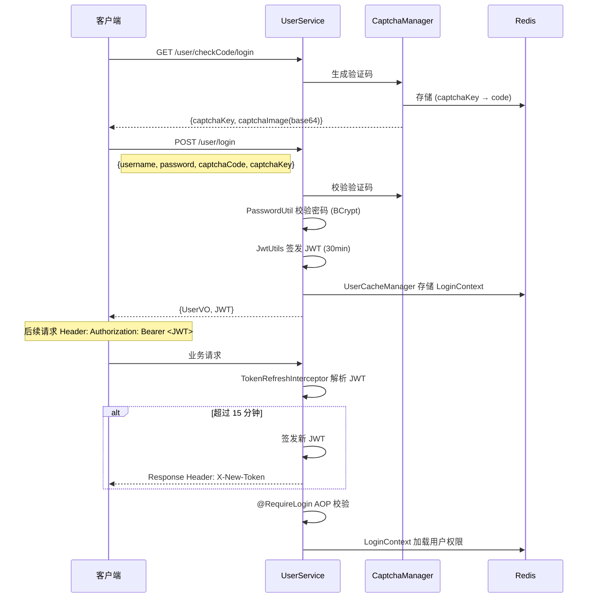
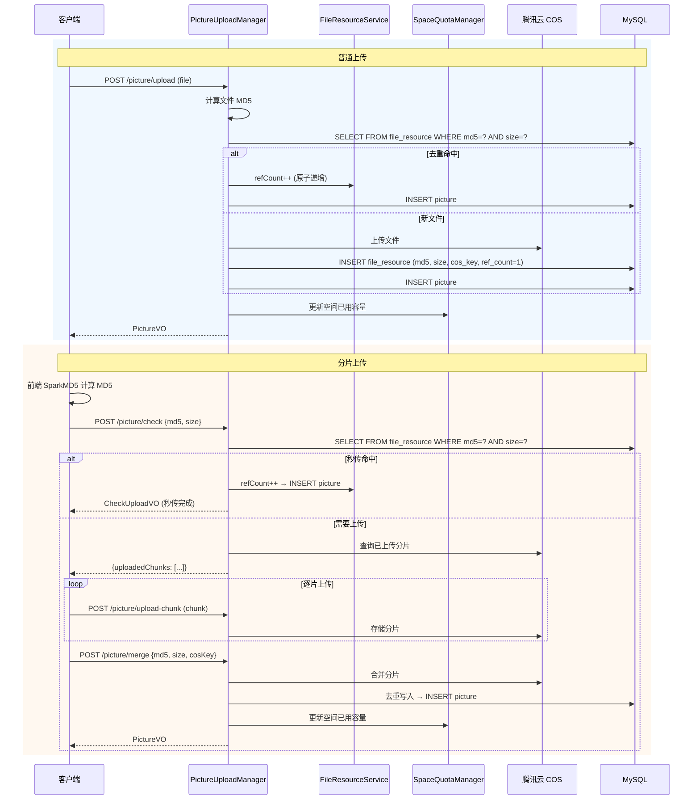
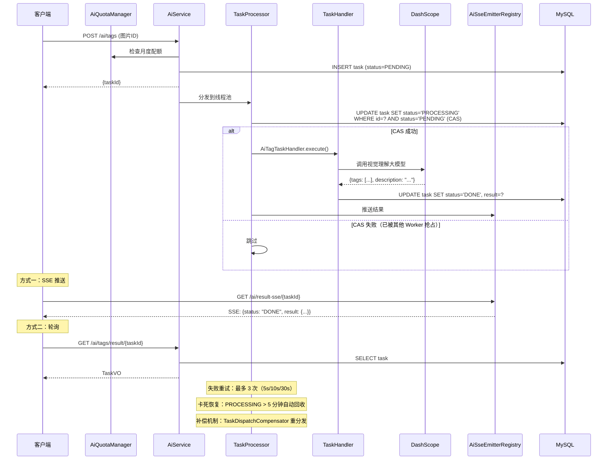
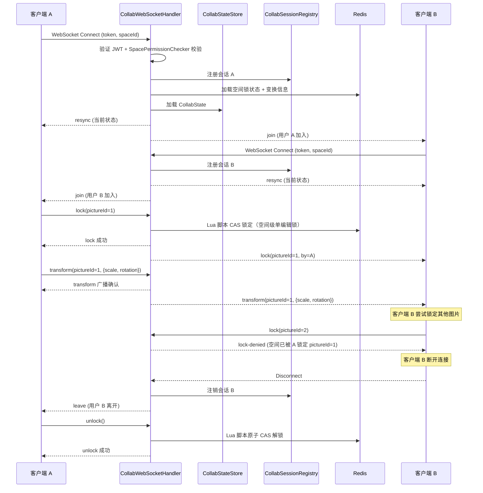
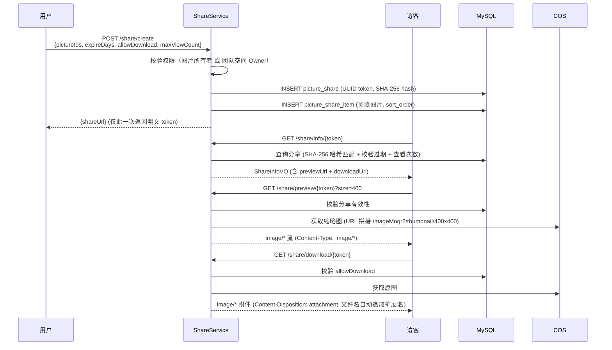

# UML 图与数据模型

> FishPics — AI 图片素材协作平台

## 目录

- [1. 用例模型](#1-用例模型)
- [2. 领域类图](#2-领域类图)
- [3. ER 图](#3-er-图)
- [4. 接口概览](#4-接口概览)
- [5. 时序图](#5-时序图)
- [6. 关键约束](#6-关键约束)

---

## 1. 用例模型

### 参与者

| 参与者 | 说明 | 权限范围 |
|--------|------|----------|
| **访客** | 未登录用户 | 验证码、注册、登录、浏览公开图片、查看分享链接 |
| **登录用户** | 已认证用户（level 0-2） | 资料维护、图片上传编辑、空间管理、分享、搜索、AI 标注 / 文生图、图片推荐 |
| **管理员** | 管理员（role=1） | 全部用户功能 + 用户 / 图片 / 空间 / 系统 / AI 管理、审计日志、数据统计 |
| **外部系统** | 第三方服务 | DashScope（AI：视觉理解 / 文生图大模型）、腾讯云 COS（存储）、Redis（缓存/锁/会话） |

### 用例图



### 用例说明

#### 访客用例

| 用例 | 前置条件 | 主流程 | 后置条件 |
|------|----------|--------|----------|
| 注册 | 无 | 获取验证码 → 填写用户名 / 密码 / 验证码 → 提交 | 创建用户 + 私人空间 |
| 登录 | 已注册 | 获取验证码 → 填写用户名 / 密码 / 验证码 → 提交 | 返回 JWT + 用户信息 |
| 浏览公开图片 | 无 | 进入首页 → 分页浏览公开图片 → 分类筛选 / 搜索 | 无 |
| 查看分享链接 | 有分享链接 | 访问分享链接 → 预览图片 → 可选下载 | 无 |

#### 登录用户用例

| 用例 | 前置条件 | 主流程 | 后置条件 |
|------|----------|--------|----------|
| 上传图片 | 已登录，有空间 | 选择文件 → 计算 MD5 → 上传（普通 / 分片 / URL 保存）→ 等待审核 | 创建 picture 记录 |
| 编辑图片 | 已登录，有图片 | 修改元数据（名称/标签/分类/描述）→ 在线裁剪 → 替换文件 | 更新 picture 记录 |
| 空间管理 | 已登录 | 创建空间 → 管理图片 → 邀请成员（团队空间，四级角色） | 空间和成员数据更新 |
| 分享图片 | 已登录，有图片 | 选择图片（支持多图，团队 Owner 可选空间内任意图片）→ 配置有效期/查看次数/下载权限 → 生成链接 | 创建 share 记录 |
| AI 标注 | 已登录，有配额 | 选择图片 → 提交标注任务 → SSE 等待结果 | 创建 task，标签写入 picture |
| AI 文生图 | 已登录，有配额 | 输入文本描述 → 选择比例/风格 → 提交生成任务 → SSE 等待结果 | 创建 task，生成新图片 |
| 图片推荐 | 已登录，功能开启 | 浏览推荐图片列表 | 无 |
| 协同编辑 | 已登录，团队成员 | 进入团队空间 → 锁定图片 → 实时编辑 → 解锁 | WebSocket 实时同步 |

#### 管理员用例

| 用例 | 前置条件 | 主流程 | 后置条件 |
|------|----------|--------|----------|
| 图片审核 | 管理员身份 | 查看待审核列表 → 审批 / 拒绝 → 可设精选 | 图片状态更新 |
| 用户管理 | 管理员身份 | 查看用户列表（多条件筛选）→ 封禁 / 解封 / 编辑等级角色 | 用户状态更新 |
| 空间管理 | 管理员身份 | 查看空间列表 → 编辑 / 删除 / 启用 / 禁用 | 空间状态更新 |
| 系统配置 | 管理员身份 | 管理分类标签 → 管理轮播图 | 配置更新 |
| AI 配置 | 管理员身份 | 查看 AI 统计 → 开关标注 / 生图 / 推荐功能 → 管理任务 | 配置更新 |
| 审计日志 | 管理员身份 | 查看审计日志列表（多条件筛选） | 无 |
| 数据统计 | 管理员身份 | 查看系统统计数据（ECharts 可视化仪表盘） | 无 |

---

## 2. 领域类图



### 类关系说明

| 关系 | 说明 |
|------|------|
| User → Space | 一个用户创建多个空间，私人空间一对一（uk_user_type 约束） |
| Space → Picture | 一个空间包含多张图片 |
| Picture → FileResource | 图片通过 resourceId 关联物理文件，去重共享 |
| Picture → PictureTag | 一张图片可有多个标签（独立表存储，M:N） |
| Picture → PictureShare | 一张图片可生成多个分享链接 |
| PictureShare → PictureShareItem | 分享链接可包含多张图片（多图分享），sort_order 控制排序 |
| Space → SpaceTeamMember | 团队空间有多个成员（四级角色：OWNER/MEMBER/EDITOR/VIEWER） |
| User → Task | 用户提交多个 AI 任务（ai_tag / ai_draw） |

---

## 3. ER 图

```mermaid
erDiagram
    USER ||--o{ SPACE : "creates"
    USER ||--o{ PICTURE : "uploads"
    USER ||--o{ TASK : "submits"
    USER ||--o{ SYS_AUDIT_LOG : "generates"
    SPACE ||--o{ PICTURE : "stores"
    SPACE ||--o{ SPACE_TEAM_MEMBER : "has_members"
    PICTURE ||--o{ PICTURE_TAG : "tagged_with"
    PICTURE ||--o| FILE_RESOURCE : "deduplicates_via"
    PICTURE ||--o{ PICTURE_SHARE : "shared_via"
    PICTURE_SHARE ||--o{ PICTURE_SHARE_ITEM : "contains"
    PICTURE ||--o{ PICTURE_SHARE_ITEM : "included_in"

    USER {
        bigint id PK
        varchar username UK "用户名"
        varchar password "BCrypt 哈希"
        varchar avatar "头像 URL"
        varchar email "邮箱"
        varchar phone "手机号"
        varchar nickname "昵称"
        tinyint role "0=普通用户 1=管理员"
        tinyint status "0=禁用 1=正常"
        tinyint level "0=普通 1=VIP 2=SVIP"
        datetime create_time
        datetime update_time
    }

    SPACE {
        bigint id PK
        varchar name "空间名称"
        tinyint type "0=私人 1=团队"
        bigint user_id FK "创建者"
        bigint storage_size "容量配额(字节)"
        bigint size "已用容量(字节)"
        tinyint status "状态"
        int version "乐观锁版本号"
        datetime create_time
        datetime update_time
    }

    PICTURE {
        bigint id PK
        bigint user_id FK "上传者"
        varchar picture_name "图片名称"
        varchar url "COS 访问地址"
        int width "宽度"
        int height "高度"
        bigint size "文件大小(字节)"
        tinyint status "0=正常 1=禁用 2=待审核"
        tinyint is_private "0=公开 1=私有"
        bigint space_id FK "所属空间"
        bigint resource_id FK "关联文件资源"
        varchar introduction "图片描述"
        varchar type "分类标签"
        tinyint is_selected "精选标记"
        int version "乐观锁版本号"
        datetime create_time
        datetime update_time
    }

    PICTURE_TAG {
        bigint picture_id FK "关联图片"
        varchar tag_name "标签文本"
        PK(picture_id, tag_name)
    }

    FILE_RESOURCE {
        bigint id PK
        varchar md5 "文件 MD5"
        bigint size "文件大小(字节)"
        varchar cos_key "COS 存储 Key"
        int ref_count "引用计数"
        int version "乐观锁版本号"
        datetime create_time
    }

    PICTURE_SHARE {
        bigint id PK
        bigint picture_id FK "主图 ID"
        bigint share_user_id FK "分享者"
        varchar share_token UK "UUID Token"
        varchar share_token_hash "SHA-256 哈希"
        datetime expire_time "过期时间"
        tinyint allow_download "是否允许下载"
        int max_view_count "最大查看次数(NULL=不限)"
        tinyint status "0=有效 1=已取消"
        datetime create_time
        datetime update_time
    }

    PICTURE_SHARE_ITEM {
        bigint id PK
        bigint share_id FK "关联分享"
        bigint picture_id FK "关联图片"
        int sort_order "排序序号"
    }

    TASK {
        bigint id PK
        varchar task_id UK "UUID 任务ID"
        bigint user_id FK "提交者"
        varchar biz_type "ai_tag / ai_draw"
        bigint biz_id "关联业务ID"
        varchar status "PENDING/PROCESSING/DONE/FAILED"
        int retry_count "重试次数"
        text param "任务参数 JSON"
        text result "结果 JSON"
        varchar error_msg "错误信息"
        datetime create_time
        datetime update_time
    }

    SPACE_TEAM_MEMBER {
        bigint id PK
        bigint space_id FK "所属空间"
        bigint user_id FK "成员用户"
        int role_id "1=所有者 2=成员 3=编辑者 4=查看者"
        datetime create_time
    }

    PIC_SYSTEM {
        bigint id PK
        varchar syskey UK "配置键"
        text sysvalue "配置值"
        datetime create_time
        datetime update_time
    }

    SYS_AUDIT_LOG {
        bigint id PK
        bigint user_id FK "操作人"
        varchar username "操作人用户名"
        varchar operation "操作描述"
        varchar module "所属模块"
        text detail "操作详情(自动脱敏)"
        varchar method "HTTP 方法"
        varchar url "请求 URL"
        text params "请求参数"
        text result "响应结果"
        varchar error_msg "异常信息"
        varchar ip "客户端 IP"
        tinyint is_delete "软删除"
        datetime create_time
    }
```

### 表说明

| 表 | 记录数预期 | 核心索引 | 说明 |
|----|-----------|----------|------|
| `user` | 千级 | `username` UK | 用户账户 |
| `space` | 千级 | `(user_id, type)` UK | 空间（私人 + 团队） |
| `picture` | 万~十万级 | `space_id` IDX, `user_id` IDX, `status` IDX, `(resource_id, user_id, space_id)` UK | 图片记录 |
| `picture_tag` | 十万级 | `picture_id` IDX, `tag_name` IDX | 图片标签（联合主键） |
| `file_resource` | 万级 | `(md5, size)` UK | 物理文件去重 |
| `picture_share` | 千级 | `share_token` UK | 分享链接 |
| `picture_share_item` | 千级 | `share_id` IDX, `picture_id` IDX | 多图分享关联 |
| `task` | 千级 | `task_id` UK, `status` IDX | AI 异步任务 |
| `space_team_member` | 千级 | `(space_id, user_id)` UK | 团队成员 |
| `pic_system` | 十级 | `syskey` UK | 系统键值配置 |
| `sys_audit_log` | 万级 | `user_id` IDX, `create_time` IDX | 审计日志 |

---

## 4. 接口概览

所有 REST 接口前缀 `/api`，详细参数和返回值参见 Knife4j 文档（启动后访问 `/api/doc.html`）。

### 用户模块 — UserController

| 方法 | 路径 | 认证 | 说明 |
|------|------|------|------|
| GET | `/user/checkCode/login` | 无 | 获取登录验证码 |
| GET | `/user/checkCode/register` | 无 | 获取注册验证码 |
| POST | `/user/register` | 无 | 用户注册 |
| POST | `/user/login` | 无 | 用户登录 |
| GET | `/user/myself` | @RequireLogin | 获取当前用户信息 |
| GET | `/user/getUser` | @RequireLogin | 获取当前用户（含权限） |
| POST | `/user/editUser` | @RequireLogin | 编辑个人资料 |
| POST | `/user/logout` | @RequireLogin | 退出登录 |
| GET | `/user/profile` | @RequireLogin | 查看用户资料 |
| GET | `/user/search` | @RequireLogin | 搜索用户 |
| POST | `/user/admin/getUser` | @RequireAdmin | 管理端：获取用户详情 |
| POST | `/user/admin/userList` | @RequireAdmin | 管理端：用户列表 |
| POST | `/user/admin/setStatus` | @RequireAdmin | 管理端：封禁 / 解封用户 |
| POST | `/user/admin/editUser` | @RequireAdmin | 管理端：编辑用户 |

### 图片模块 — PictureController

| 方法 | 路径 | 认证 | 说明 |
|------|------|------|------|
| POST | `/picture/upload` | @RequireLogin | 上传图片（普通） |
| POST | `/picture/avatar` | @RequireLogin | 上传头像 |
| POST | `/picture/save-by-url` | @RequireLogin | URL 保存图片 |
| POST | `/picture/check` | @RequireLogin | 分片上传：秒传 / 续传校验 |
| POST | `/picture/upload-chunk` | @RequireLogin | 分片上传：上传单个分片 |
| POST | `/picture/merge` | @RequireLogin | 分片上传：合并分片 |
| POST | `/picture/list` | 无 | 公开图片列表（分页） |
| POST | `/picture/recommend` | @RequireLogin | AI 推荐图片 |
| POST | `/picture/delete` | @RequireLogin | 删除图片（单张/批量） |
| PUT | `/picture/update` | @RequireLogin | 编辑图片元数据 |
| POST | `/picture/replace` | @RequireLogin | 替换图片文件 |
| GET | `/picture/pictureEditMessage` | @RequireLogin | 获取图片编辑信息 |
| POST | `/picture/admin/list` | @RequireAdmin | 管理端：图片列表 |
| POST | `/picture/admin/review` | @RequireAdmin | 管理端：审核图片 |

### 分享模块 — ShareController

| 方法 | 路径 | 认证 | 说明 |
|------|------|------|------|
| POST | `/share/create` | @RequireLogin | 创建分享链接（支持多图，团队 Owner 可分享空间内任意图片） |
| GET | `/share/info/{token}` | 无 | 获取分享信息 |
| GET | `/share/preview/{token}` | 无 | 预览分享图片（支持 `size` 参数获取缩略图，Content-Type: image/*） |
| GET | `/share/download/{token}` | 无 | 下载分享图片（文件名自动追加扩展名） |
| POST | `/share/cancel` | @RequireLogin | 取消分享 |

### 空间模块 — SpaceController

| 方法 | 路径 | 认证 | 说明 |
|------|------|------|------|
| POST | `/space/create` | @RequireLogin | 创建空间 |
| GET | `/space/list` | @RequireLogin | 空间列表（按类型） |
| GET | `/space/getSpace` | @RequireLogin | 空间详情 |
| POST | `/space/update` | @RequireLogin | 更新空间 |
| POST | `/space/pictureList` | @RequireLogin | 空间内图片列表 |
| GET | `/space/saveable` | @RequireLogin | 可保存图片的空间列表 |
| GET | `/space/team/members` | @RequireLogin | 团队成员列表 |
| POST | `/space/team/invite` | @RequireLogin | 邀请成员 |
| POST | `/space/team/remove` | @RequireLogin | 移除成员 |
| POST | `/space/team/changeRole` | @RequireLogin | 变更成员角色 |
| POST | `/space/admin/list` | @RequireAdmin | 管理端：空间列表 |
| POST | `/space/admin/update` | @RequireAdmin | 管理端：更新空间 |
| POST | `/space/admin/delete` | @RequireAdmin | 管理端：删除空间 |
| POST | `/space/admin/setStatus` | @RequireAdmin | 管理端：启用 / 禁用空间 |

### AI 模块 — AiController

| 方法 | 路径 | 认证 | 说明 |
|------|------|------|------|
| POST | `/ai/tags` | @RequireLogin | 提交 AI 标注任务 |
| GET | `/ai/tags/result/{taskId}` | @RequireLogin | 查询标注结果 |
| POST | `/ai/draw/submit` | @RequireLogin | 提交文生图任务 |
| GET | `/ai/draw/result/{taskId}` | @RequireLogin | 查询生成结果 |
| GET | `/ai/result-sse/{taskId}` | @RequireLogin | SSE 实时推送结果 |
| GET | `/ai/download-image/{taskId}` | @RequireLogin | 下载 AI 生成图片 |
| POST | `/ai/admin/tasks` | @RequireAdmin | 管理端：任务列表 |
| GET | `/ai/admin/stats` | @RequireAdmin | 管理端：AI 统计 |
| GET | `/ai/admin/config` | @RequireAdmin | 管理端：获取 AI 配置 |
| POST | `/ai/admin/config` | @RequireAdmin | 管理端：更新 AI 配置 |

### 系统模块 — SystemController + AuditLogController

| 方法 | 路径 | 认证 | 说明 |
|------|------|------|------|
| GET | `/system/list` | 无 | 获取分类标签 |
| POST | `/system/addList` | @RequireAdmin | 管理端：添加标签 |
| POST | `/system/deleteType` | @RequireAdmin | 管理端：删除标签 |
| GET | `/system/marquee` | 无 | 获取轮播图 |
| POST | `/system/addMarquee` | @RequireAdmin | 管理端：添加轮播图 |
| POST | `/system/deleteMarquee` | @RequireAdmin | 管理端：删除轮播图 |
| POST | `/system/audit-log/list` | @RequireAdmin | 管理端：审计日志列表 |
| GET | `/system/stats` | @RequireAdmin | 管理端：系统统计数据 |

### WebSocket

| 路径 | 认证 | 说明 |
|------|------|------|
| `/ws/collab?token=<JWT>&spaceId=<id>` | JWT（连接时验证） | 实时协同编辑 |

**消息类型**：

| 类型 | 方向 | 说明 |
|------|------|------|
| `join` | 客户端 → 服务端 | 加入空间编辑会话 |
| `leave` | 客户端 → 服务端 | 离开空间编辑会话 |
| `presence` | 服务端 → 客户端 | 当前在线用户列表 |
| `lock` | 客户端 → 服务端 → 全体 | 锁定图片（空间级单编辑锁） |
| `unlock` | 客户端 → 服务端 → 全体 | 释放图片锁 |
| `lock-denied` | 服务端 → 客户端 | 锁定被拒绝（空间已有其他图片被锁定） |
| `transform` | 客户端 → 服务端 → 全体 | 图片变换操作（scale, rotation, crop） |
| `file-replaced` | 客户端 → 服务端 → 全体 | 图片文件已替换 |
| `resync` | 服务端 → 客户端 | 重连后同步当前状态 |

---

## 5. 时序图

### 5.1 登录流程



### 5.2 图片上传流程



### 5.3 AI 任务流程



### 5.4 协同编辑流程



### 5.5 分享流程



---

## 6. 关键约束

### 唯一约束

| 表 | 约束 | 说明 |
|-----|------|------|
| `user` | `username` UNIQUE | 用户名全局唯一 |
| `file_resource` | `(md5, size)` UNIQUE | 同一大小 + MD5 的文件只存一份 |
| `space` | `(user_id, type)` UNIQUE | 每用户每类型空间唯一（私人空间只有一个） |
| `space_team_member` | `(space_id, user_id)` UNIQUE | 一个用户在一个空间只能有一个角色 |
| `picture` | `(resource_id, user_id, space_id)` UNIQUE | 同一空间内同一文件资源唯一 |
| `task` | `task_id` UNIQUE | 任务 ID 全局唯一 |
| `picture_share` | `share_token` UNIQUE | 分享 Token 全局唯一 |
| `pic_system` | `syskey` UNIQUE | 系统配置键唯一 |

### 业务约束

| 约束 | 说明 |
|------|------|
| `file_resource.ref_count >= 0` | 引用计数不能为负（CHECK 约束） |
| 私人空间唯一 | 每个用户有且仅有一个私人空间（type=0，uk_user_type 约束） |
| 分享权限 | 只能分享自己的图片或所在团队空间 Owner 身份的图片 |
| 分享免登录 | `/share/preview/*` 和 `/share/download/*` 无需认证 |
| 分享防 XSS | 仅返回 `image/*` Content-Type |
| 分享缩略图 | 预览接口支持 `size` 参数，通过 COS imageMogr2 实时生成缩略图 |
| 分享下载扩展名 | 下载文件名无扩展名时根据 Content-Type 自动追加 |
| 审计日志脱敏 | 自动过滤 `password`、`token`、`apiKey`、`secret` 等字段 |
| 图片审核 | 上传后默认 status=2（待审核），管理员审批后 status=0 |
| 乐观锁 | `space`、`file_resource`、`picture` 表使用 version 字段防并发写入 |
| 空间级单编辑锁 | 同一空间同时只允许编辑一张图片（Redis 分布式锁，TTL 30 分钟） |
| AI 月度配额 | 按用户等级分配月度 AI 使用配额（Redis 计数管理） |
| AI 功能开关 | 标注 / 生图 / 推荐三项能力可独立开关（pic_system 配置表） |
