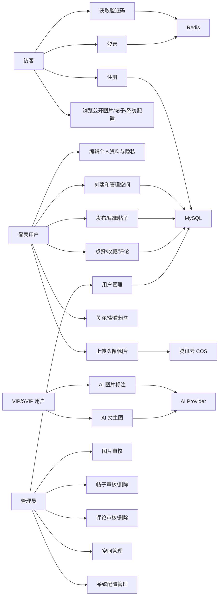
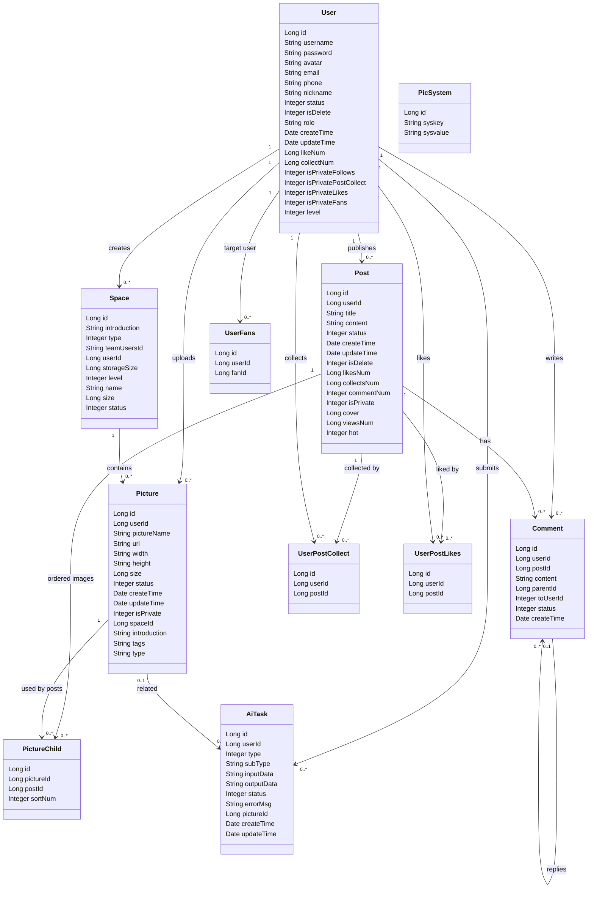
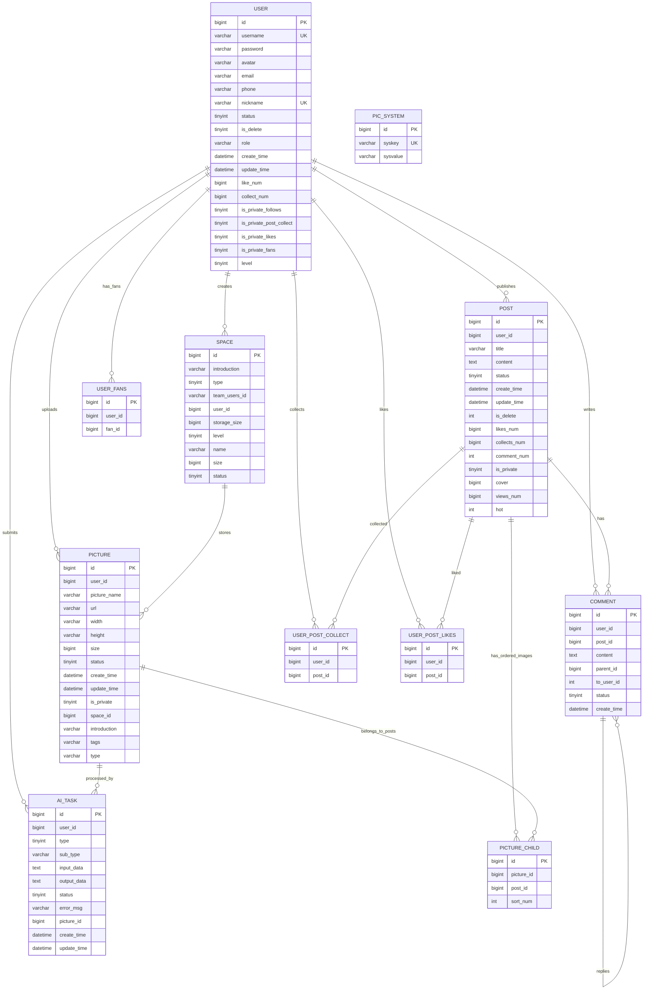
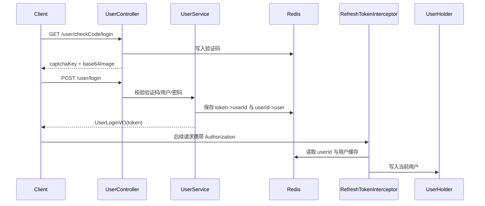
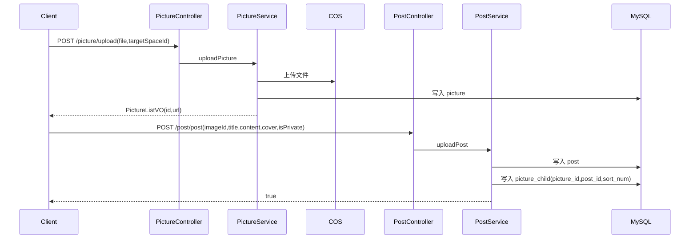
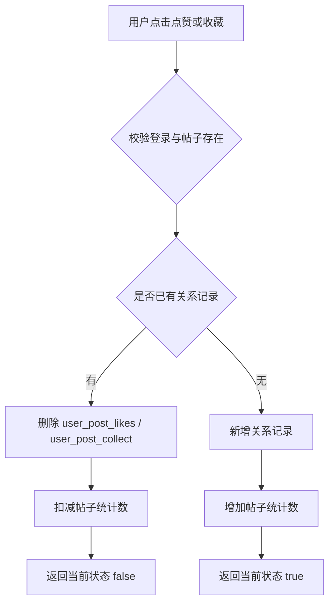
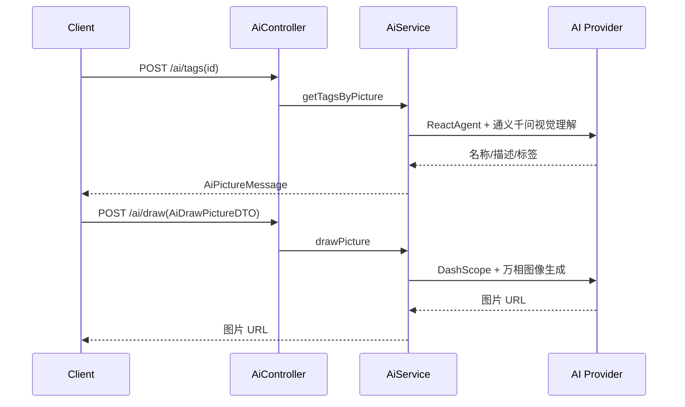
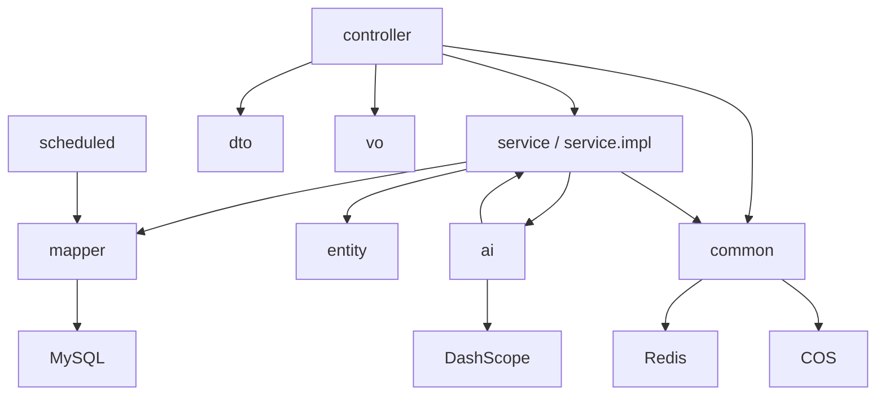

# FishPics 后端 UML 与数据模型

> 本文档基于当前 `src/FishPics-backend` 后端代码重构，重点描述参与者、用例、类结构、实体关系、请求流和 AI 任务流。

## 1. 用例模型

### 1.1 参与者

| 参与者 | 说明 |
| --- | --- |
| 访客 | 可查看公开配置、获取验证码、注册、登录、浏览公开内容 |
| 登录用户 | 可维护个人资料、上传图片、管理空间、发布帖子、互动、评论、关注 |
| VIP/SVIP 用户 | 继承登录用户能力，并可使用 AI 标注和文生图能力 |
| 管理员 | 可管理用户、图片、帖子、评论、空间、系统配置 |
| AI Provider | DashScope / 阿里云模型服务，执行视觉理解和图像生成 |
| COS 对象存储 | 保存头像和图片文件 |
| Redis | 保存验证码、Token、用户缓存、系统配置缓存 |
| MySQL | 保存业务主数据 |

### 1.2 用例图

### 1.3 权限矩阵

| 模块 | 访客 | 登录用户 | VIP/SVIP | 管理员 |
| --- | --- | --- | --- | --- |
| 验证码、注册、登录 | 是 | 是 | 是 | 是 |
| 公开图片、帖子、系统配置查询 | 是 | 是 | 是 | 是 |
| 当前用户、资料、隐私、退出 | 否 | 是 | 是 | 是 |
| 上传图片、空间、发帖、互动、评论 | 否 | 是 | 是 | 是 |
| AI 标签识别、文生图 | 否 | 否 | 是 | 是 |
| 后台管理接口 | 否 | 否 | 否 | 是 |

## 2. 领域类图

## 3. 数据库 ER 图

## 4. 控制器接口模型

### 4.1 UserController

| 方法 | 路径 | 入参 | 出参 | 权限 |
| --- | --- | --- | --- | --- |
| `POST` | `/user/login` | `UserLoginRequest` | `UserLoginVO` | 公开 |
| `POST` | `/user/register` | `UserRequestRequest` | `Boolean` | 公开 |
| `GET` | `/user/checkCode/register` | - | `CheckCodeVO` | 公开 |
| `GET` | `/user/checkCode/login` | - | `CheckCodeVO` | 公开 |
| `GET` | `/user/myself` | - | `UserMessageVO` | 登录 |
| `GET` | `/user/getUser` | - | `UserLoginVO` | 登录 |
| `POST` | `/user/editUser` | `UserEditRequest` | `Boolean` | 登录 |
| `POST` | `/user/logout` | `Authorization` | 空响应 | 登录 |
| `POST` | `/user/privacy` | `UserPrivacyRequest` | `Boolean` | 登录 |
| `POST` | `/user/follow` | `UserIdRequest` | `Boolean` | 登录 |
| `GET` | `/user/fans` | `userId,current,pageSize` | `IPage<FollowUserVO>` | 登录 |
| `GET` | `/user/follows` | `userId,current,pageSize` | `IPage<FollowUserVO>` | 登录 |
| `GET` | `/user/profile` | `userId` | `UserPublicProfileVO` | 登录 |
| `POST` | `/user/admin/getUser` | `UserIdRequest` | `AdminGetUserVO` | 管理员 |
| `POST` | `/user/admin/userList` | `UserQueryWrapper` | `IPage<User>` | 管理员 |
| `POST` | `/user/admin/setStatus` | `UserIdRequest` | `Boolean` | 管理员 |
| `POST` | `/user/admin/editUser` | `UserEditByAdminRequest` | `Boolean` | 管理员 |

### 4.2 PictureController

| 方法 | 路径 | 入参 | 出参 | 权限 |
| --- | --- | --- | --- | --- |
| `POST` | `/picture/avatar` | `file,id` | `String` | 登录 |
| `POST` | `/picture/upload` | `file,targetSpaceId?` | `PictureListVO` | 登录 |
| `POST` | `/picture/list` | `PictureQueryRequest` | `IPage<PictureListVO>` | 公开 |
| `DELETE` | `/picture/delete` | `DeleteByIdList` | `String` | 登录 |
| `PUT` | `/picture/update` | `PictureUpdateRequest` | `Boolean` | 登录 |
| `GET` | `/picture/pictureEditMessage` | `id` | `PictureEditVO` | 登录 |
| `POST` | `/picture/admin/list` | `PageRequest,status?` | `IPage<PictureAdminVO>` | 管理员 |
| `POST` | `/picture/admin/review` | `pictureId,status,selected` | `Boolean` | 管理员；`selected` 写入 `is_private`，表示是否公开到首页 |

### 4.3 PostController

| 方法 | 路径 | 入参 | 出参 | 权限 |
| --- | --- | --- | --- | --- |
| `POST` | `/post/post` | `UploadPostRequest` | `Boolean` | 登录 |
| `GET` | `/post/getPost` | `id` | `PostDetailVO` | 白名单路径；当前仅按 ID 查询，未强制校验 `status` 或 `is_private` |
| `POST` | `/post/editPost` | `EditPostRequest` | `Boolean` | 作者 |
| `POST` | `/post/postList` | `PostQueryRequest` | `IPage<PostListVO>` | 白名单路径；默认筛 `status=1`，不默认筛 `is_private=0` |
| `POST` | `/post/like` | `id` | `Boolean` | 登录 |
| `POST` | `/post/collect` | `id` | `Boolean` | 登录 |
| `POST` | `/post/pictureList` | `GetPictureBySpaceRequest` | `Map<String,Object>` | 登录 |
| `POST` | `/post/myPosts` | `PageRequest` | `IPage<PostListVO>` | 登录 |
| `POST` | `/post/myCollects` | `PageRequest` | `IPage<PostListVO>` | 登录 |
| `POST` | `/post/myLikes` | `PageRequest` | `IPage<PostListVO>` | 登录 |
| `POST` | `/post/admin/list` | `PostQueryRequest` | `IPage<PostListVO>` | 管理员 |
| `POST` | `/post/admin/review` | `id,status` | `Boolean` | 管理员 |
| `POST` | `/post/admin/delete` | `id` | `Boolean` | 管理员 |

### 4.4 CommentController

| 方法 | 路径 | 入参 | 出参 | 权限 |
| --- | --- | --- | --- | --- |
| `POST` | `/comment/create` | `CreateCommentRequest` | `Long` | 登录 |
| `POST` | `/comment/list` | `CommentQueryRequest` | `IPage<CommentVO>` | 公开 |
| `POST` | `/comment/delete` | `id` | `Boolean` | 登录 |
| `POST` | `/comment/admin/list` | `CommentQueryRequest` | `IPage<CommentVO>` | 管理员 |
| `POST` | `/comment/review` | `id,status` | `Boolean` | 管理员 |
| `POST` | `/comment/adminDelete` | `id` | `Boolean` | 管理员 |

### 4.5 SpaceController

| 方法 | 路径 | 入参 | 出参 | 权限 |
| --- | --- | --- | --- | --- |
| `POST` | `/space/create` | `CreateSpace` | `Boolean` | 登录 |
| `GET` | `/space/list` | `type` | `List<SpaceVO>` | 登录 |
| `GET` | `/space/getSpace` | `id` | `SpaceVO` | 登录/成员 |
| `POST` | `/space/update` | `UpdateSpace` | `Boolean` | 拥有者/管理员 |
| `POST` | `/space/pictureList` | `SpacePictureList` | `PicturePageVO` | 登录/成员 |
| `POST` | `/space/admin/list` | `SpaceQueryWrapper` | `IPage<SpaceVO>` | 管理员 |
| `POST` | `/space/admin/update` | `SpaceAdminUpdateRequest` | `Boolean` | 管理员 |
| `POST` | `/space/admin/delete` | `SpaceDeleteRequest` | `Boolean` | 管理员 |
| `POST` | `/space/admin/setStatus` | `SpaceSetStatusRequest` | `Boolean` | 管理员 |

### 4.6 SystemController

| 方法 | 路径 | 入参 | 出参 | 权限 |
| --- | --- | --- | --- | --- |
| `GET` | `/system/list` | - | `List<String>` | 公开 |
| `POST` | `/system/addList` | `AddSysPicType` | `Boolean` | 管理员 |
| `POST` | `/system/deleteType` | `DeleteTypeRequest` | `Boolean` | 管理员 |
| `GET` | `/system/marquee` | - | `List<String>` | 公开 |
| `POST` | `/system/addMarquee` | `AddSysMarquee` | `Boolean` | 管理员 |
| `POST` | `/system/deleteMarquee` | `DeleteMarqueeRequest` | `Boolean` | 管理员 |

### 4.7 AiController

| 方法 | 路径 | 入参 | 出参 | 权限 |
| --- | --- | --- | --- | --- |
| `POST` | `/ai/tags` | `id` | `AiPictureMessage` | VIP/SVIP（登录校验 + level >= 1） |
| `POST` | `/ai/draw` | `AiDrawPictureDTO` | `String` | VIP/SVIP（登录校验 + level >= 1） |

注：`/ai/**` 路径在 `MvcConfig` 中被排除在登录拦截器之外。

## 5. 关键流程图

### 5.1 登录鉴权流程

### 5.2 发帖与图片关联流程

### 5.3 点赞/收藏流程

### 5.4 AI 调用流程

## 6. DTO/VO 模型摘要

### 6.1 主要请求 DTO

| DTO | 主要字段 | 使用场景 |
| --- | --- | --- |
| `UserLoginRequest` | `username,password,checkCode,captchaKey` | 登录 |
| `UserRequestRequest` | `username,password,checkPassword,checkCode,captchaKey` | 注册 |
| `UserEditRequest` | `id,username,password,avatar,email,phone,nickname` | 编辑本人资料 |
| `UserPrivacyRequest` | 隐私开关字段 | 更新隐私 |
| `UserQueryWrapper` | 用户筛选与分页字段 | 后台用户查询 |
| `UploadPostRequest` | `imageId,title,content,cover,isPrivate` | 发布帖子 |
| `EditPostRequest` | `id,imageId,title,content,cover,isPrivate` | 编辑帖子 |
| `PostQueryRequest` | `userId,text,updateTime,hotPost,current,pageSize` | 帖子分页查询 |
| `CreateCommentRequest` | `postId,content,parentId,toUserId` | 创建评论 |
| `CommentQueryRequest` | 评论分页与筛选字段 | 评论列表 |
| `CreateSpace` | `name,introduction,type` | 创建空间 |
| `UpdateSpace` | `id,name,introduction` | 更新空间 |
| `SpacePictureList` | `spaceId,current,pageSize` | 空间图片列表 |
| `SpaceQueryWrapper` | 空间筛选与分页 | 后台空间列表 |
| `SpaceAdminUpdateRequest` | 空间后台可改字段 | 后台空间编辑 |
| `SpaceDeleteRequest` | `id` | 后台删除空间 |
| `SpaceSetStatusRequest` | `id,status` | 后台设置空间状态 |
| `PictureQueryRequest` | `tag,current,pageSize` | 图片列表查询 |
| `PictureUpdateRequest` | `ids,pictureName,introduction,pictureUrl` | 图片信息编辑 |
| `DeleteByIdList` | `ids` | 批量删除图片 |
| `AddSysPicType` | `typeList` | 添加分类标签 |
| `AddSysMarquee` | `marqueeList` | 添加跑马灯 |
| `DeleteTypeRequest` | `value` | 删除分类标签 |
| `DeleteMarqueeRequest` | `url` | 删除跑马灯 |
| `AiDrawPictureDTO` | `description,exclusion,style,width,height` | AI 文生图 |
| `PageRequest` | `current,pageSize,sortField,sortOrder` | 通用分页查询 |

### 6.2 主要响应 VO

| VO | 用途 |
| --- | --- |
| `UserLoginVO` | 登录态用户信息和 Token |
| `UserMessageVO` | 个人主页聚合信息 |
| `UserPublicProfileVO` | 用户公开主页 |
| `FollowUserVO` | 粉丝/关注列表项 |
| `CheckCodeVO` | 验证码图片与 key |
| `PictureListVO` | 图片列表基础项 |
| `PictureAdminVO` | 后台图片管理项 |
| `PictureEditVO` | 图片编辑信息 |
| `PicturePageVO` | 空间图片分页 |
| `PostListVO` | 帖子列表项 |
| `PostDetailVO` | 帖子详情聚合 |
| `CommentVO` | 评论展示项 |
| `SpaceVO` | 空间展示项 |
| `SpaceMemberVO` | 团队成员展示项 |
| `AiPictureMessage` | AI 标注结果（名称、描述、标签列表） |
| `AdminGetUserVO` | 管理员查看用户详情 |

## 7. 状态与约束

### 7.1 状态字段

| 模型 | 字段 | 值 |
| --- | --- | --- |
| `User` | `status` | `0` 禁用，`1` 正常，`2` 待审核 |
| `Picture` | `status` | `0` 禁用，`1` 正常，`2` 待审核 |
| `Post` | `status` | `0` 禁用，`1` 正常，`2` 待审核 |
| `Comment` | `status` | `0` 禁用，`1` 正常，`2` 待审核 |
| `Space` | `status` | `0` 禁用，`1` 正常 |
| `AiTask` | `status` | `0` 处理中，`1` 成功，`2` 失败 |

### 7.2 关键约束

- `user.username`、`user.nickname` 唯一。
- `pic_system.syskey` 唯一。
- `picture_child` 对 `picture_id + post_id` 建立唯一索引。
- 帖子图片顺序必须依赖 `picture_child.sort_num`。
- `picture.is_private` 当前承担首页公开标记含义：`0` 不公开到首页，`1` 公开到首页；管理员图片审核接口的 `selected` 参数会写入该字段。
- `picture.tags` 存储 AI 标签，格式为 JSON 数组（如 `["人物","风景"]`）。注意：代码中存在 JSON 序列化和逗号分割两种读取方式。
- `picture.type` 存储图片格式类型，仅 Java 实体和 XML Mapper 中存在，对应 `create.sql` 缺少该列。
- `comment.to_user_id` 在 Java 实体中为 `Long`，SQL DDL 中为 `int`。
- 普通用户不能调用 AI 能力，必须 `level >= 1`。
- 热度定时任务（`HotScoreScheduler`）每 10 分钟执行一次：`hot = likes_num * 3 + collects_num * 3 + comment_num * 2 + views_num * 2`。

## 8. 包依赖视图

