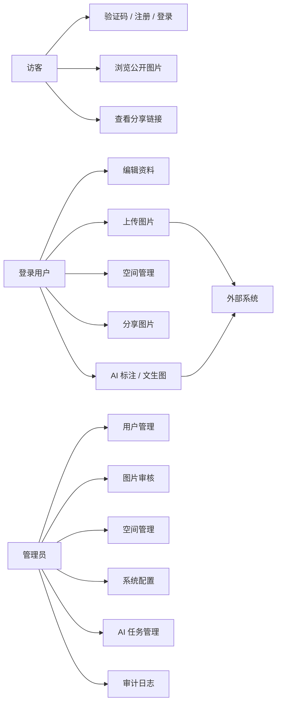
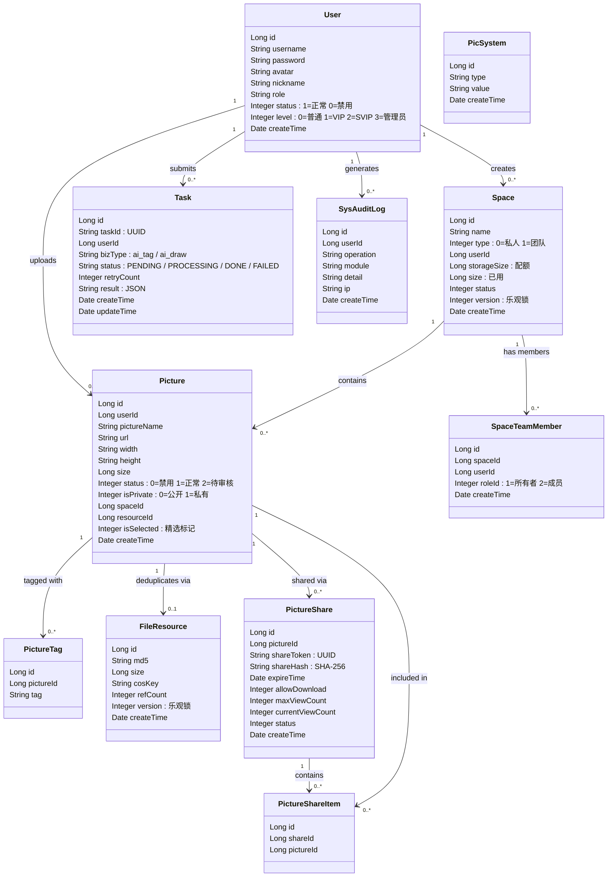
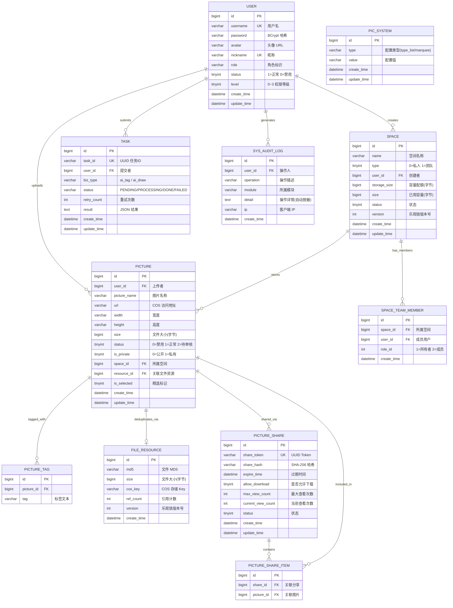
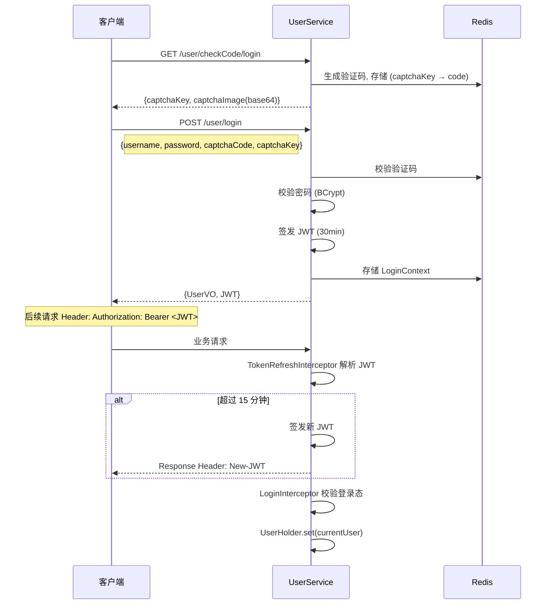
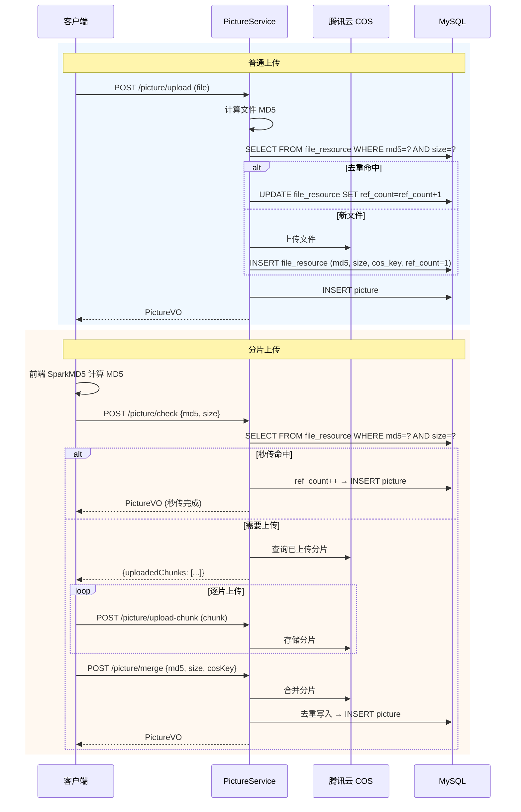
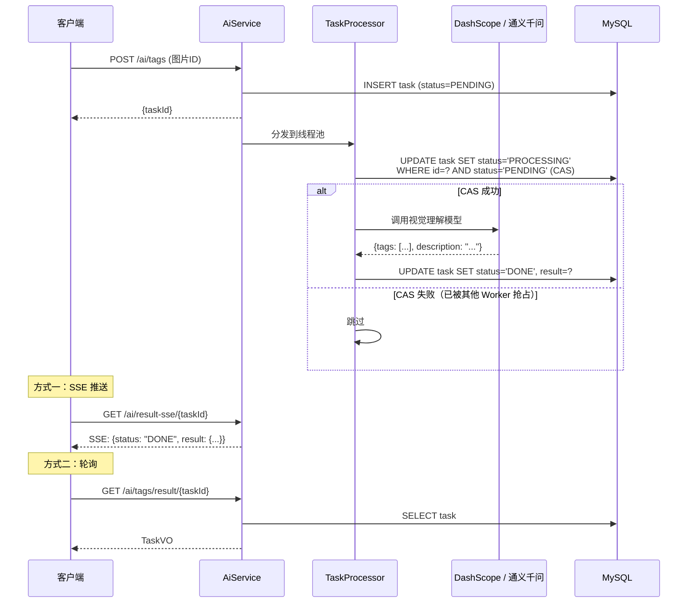
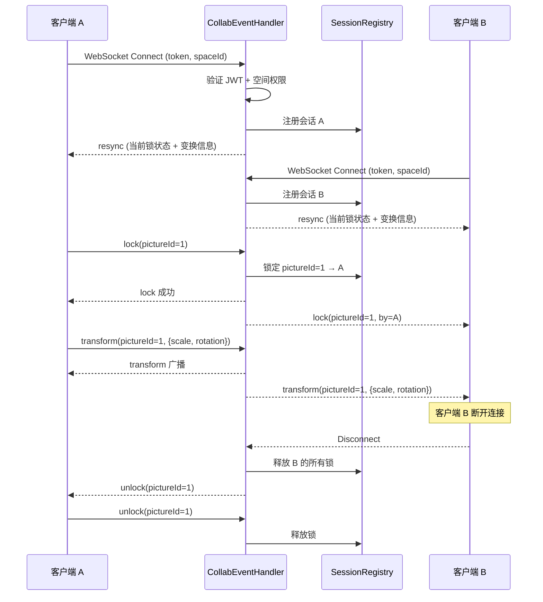
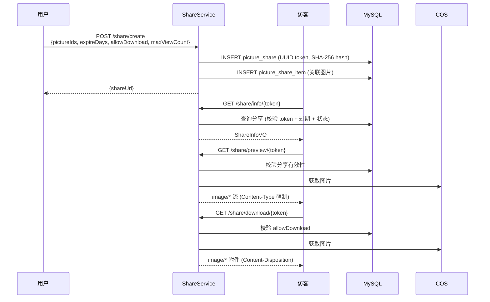

# UML 图与数据模型

> FishPics — AI 图片素材协作平台

## 目录

- [1. 用例模型](#1-用例模型)
- [2. 领域类图](#2-领域类图)
- [3. ER 图](#3-er-图)
- [4. 接口概览](#4-接口概览)
- [5. 时序图](#5-时序图)
- [6. 关键约束](#6-关键约束)

---

## 1. 用例模型

### 参与者

| 参与者 | 说明 | 权限范围 |
|--------|------|----------|
| **访客** | 未登录用户 | 验证码、注册、登录、浏览公开图片、查看分享链接 |
| **登录用户** | 已认证用户（level 0-2） | 资料维护、图片上传、空间管理、分享、搜索、AI 标注 / 文生图 |
| **管理员** | 管理员（level >= 3） | 全部用户功能 + 用户 / 图片 / 空间 / 系统 / AI 管理、审计日志 |
| **外部系统** | 第三方服务 | DashScope（AI）、腾讯云 COS（存储）、Redis、RocketMQ |

### 用例图

### 用例说明

#### 访客用例

| 用例 | 前置条件 | 主流程 | 后置条件 |
|------|----------|--------|----------|
| 注册 | 无 | 获取验证码 → 填写用户名 / 密码 / 验证码 → 提交 | 创建用户 + 私人空间 |
| 登录 | 已注册 | 获取验证码 → 填写用户名 / 密码 / 验证码 → 提交 | 返回 JWT + 用户信息 |
| 浏览公开图片 | 无 | 进入首页 → 分页浏览公开图片 | 无 |
| 查看分享链接 | 有分享链接 | 访问分享链接 → 预览图片 | 无 |

#### 登录用户用例

| 用例 | 前置条件 | 主流程 | 后置条件 |
|------|----------|--------|----------|
| 上传图片 | 已登录，有空间 | 选择文件 → 计算 MD5 → 上传（普通 / 分片）→ 等待审核 | 创建 picture 记录 |
| 空间管理 | 已登录 | 创建空间 → 管理图片 → 邀请成员（团队空间） | 空间和成员数据更新 |
| 分享图片 | 已登录，有图片 | 选择图片 → 配置有效期和权限 → 生成链接 | 创建 share 记录 |
| AI 标注 | 已登录 | 选择图片 → 提交标注任务 → 等待结果 | 创建 task，标签写入 picture |
| AI 文生图 | 已登录 | 输入文本描述 → 提交生成任务 → 等待结果 | 创建 task，生成新图片 |

#### 管理员用例

| 用例 | 前置条件 | 主流程 | 后置条件 |
|------|----------|--------|----------|
| 图片审核 | 管理员身份 | 查看待审核列表 → 审批 / 拒绝 → 可设精选 | 图片状态更新 |
| 用户管理 | 管理员身份 | 查看用户列表 → 封禁 / 解封 / 编辑 | 用户状态更新 |
| AI 配置 | 管理员身份 | 查看 AI 统计 → 开关标注 / 生图 / 推荐功能 | 配置更新 |

---

## 2. 领域类图

### 类关系说明

| 关系 | 说明 |
|------|------|
| User → Space | 一个用户创建多个空间，私人空间一对一 |
| Space → Picture | 一个空间包含多张图片 |
| Picture → FileResource | 图片通过 resourceId 关联物理文件，去重共享 |
| Picture → PictureTag | 一张图片可有多个标签（独立表存储） |
| Picture → PictureShare | 一张图片可生成多个分享链接 |
| PictureShare → PictureShareItem | 分享链接可包含多张图片（多图分享） |
| Space → SpaceTeamMember | 团队空间有多个成员 |
| User → Task | 用户提交多个 AI 任务 |

---

## 3. ER 图

### 表说明

| 表 | 记录数预期 | 核心索引 | 说明 |
|----|-----------|----------|------|
| `user` | 千级 | `username` UK, `nickname` UK | 用户账户 |
| `space` | 千级 | `user_id` IDX | 空间（私人 + 团队） |
| `picture` | 万~十万级 | `space_id` IDX, `user_id` IDX, `status` IDX | 图片记录 |
| `picture_tag` | 十万级 | `picture_id` IDX, `tag` IDX | 图片标签 |
| `file_resource` | 万级 | `(md5, size)` UK | 物理文件去重 |
| `picture_share` | 千级 | `share_token` UK | 分享链接 |
| `picture_share_item` | 千级 | `share_id` IDX, `picture_id` IDX | 多图分享关联 |
| `task` | 千级 | `task_id` UK, `status` IDX | AI 异步任务 |
| `space_team_member` | 千级 | `(space_id, user_id)` UK | 团队成员 |
| `pic_system` | 十级 | `type` IDX | 系统键值配置 |
| `sys_audit_log` | 万级 | `user_id` IDX, `create_time` IDX | 审计日志 |

---

## 4. 接口概览

所有 REST 接口前缀 `/api`，详细参数和返回值参见 Knife4j 文档（启动后访问 `/api/doc.html`）。

### 用户模块 — UserController

| 方法 | 路径 | 认证 | 说明 |
|------|------|------|------|
| GET | `/user/checkCode/login` | 无 | 获取登录验证码 |
| GET | `/user/checkCode/register` | 无 | 获取注册验证码 |
| POST | `/user/register` | 无 | 用户注册 |
| POST | `/user/login` | 无 | 用户登录 |
| GET | `/user/myself` | @RequireLogin | 获取当前用户信息 |
| GET | `/user/getUser` | @RequireLogin | 获取当前用户（含权限） |
| POST | `/user/editUser` | @RequireLogin | 编辑个人资料 |
| POST | `/user/logout` | @RequireLogin | 退出登录 |
| GET | `/user/profile` | 无 | 查看公开用户资料 |
| GET | `/user/search` | @RequireLogin | 搜索用户 |
| POST | `/user/admin/getUser` | @RequireAdmin | 管理端：获取用户详情 |
| POST | `/user/admin/userList` | @RequireAdmin | 管理端：用户列表 |
| POST | `/user/admin/setStatus` | @RequireAdmin | 管理端：封禁 / 解封用户 |
| POST | `/user/admin/editUser` | @RequireAdmin | 管理端：编辑用户 |

### 图片模块 — PictureController

| 方法 | 路径 | 认证 | 说明 |
|------|------|------|------|
| POST | `/picture/upload` | @RequireLogin | 上传图片（普通） |
| POST | `/picture/save-by-url` | @RequireLogin | URL 保存图片 |
| POST | `/picture/avatar` | @RequireLogin | 上传头像（5MB 限制） |
| POST | `/picture/list` | 无 | 公开图片列表（分页） |
| POST | `/picture/recommend` | @RequireLogin | AI 推荐图片 |
| POST | `/picture/delete` | @RequireLogin | 批量删除图片 |
| PUT | `/picture/update` | @RequireLogin | 编辑图片元数据 |
| POST | `/picture/replace` | @RequireLogin | 替换图片（协同编辑） |
| GET | `/picture/pictureEditMessage` | 无 | 获取图片编辑信息 |
| POST | `/picture/check` | @RequireLogin | 分片上传：秒传 / 续传校验 |
| POST | `/picture/upload-chunk` | @RequireLogin | 分片上传：上传单个分片 |
| POST | `/picture/merge` | 无 | 分片上传：合并分片 |
| POST | `/picture/admin/list` | @RequireAdmin | 管理端：图片列表 |
| POST | `/picture/admin/review` | @RequireAdmin | 管理端：审核图片 |

### 分享模块 — ShareController

| 方法 | 路径 | 认证 | 说明 |
|------|------|------|------|
| POST | `/share/create` | @RequireLogin | 创建分享链接 |
| GET | `/share/info/{token}` | 无 | 获取分享信息 |
| GET | `/share/preview/{token}` | 无 | 预览分享图片（流式） |
| GET | `/share/download/{token}` | 无 | 下载分享图片 |
| POST | `/share/cancel` | @RequireLogin | 取消分享 |

### 空间模块 — SpaceController

| 方法 | 路径 | 认证 | 说明 |
|------|------|------|------|
| POST | `/space/create` | @RequireLogin | 创建空间 |
| GET | `/space/list` | @RequireLogin | 空间列表（按类型） |
| GET | `/space/getSpace` | @RequireLogin | 空间详情 |
| POST | `/space/update` | @RequireLogin | 更新空间 |
| POST | `/space/pictureList` | @RequireLogin | 空间内图片列表 |
| GET | `/space/saveable` | @RequireLogin | 可保存图片的空间 |
| GET | `/space/team/members` | @RequireLogin | 团队成员列表 |
| POST | `/space/team/invite` | @RequireLogin | 邀请成员 |
| POST | `/space/team/remove` | @RequireLogin | 移除成员 |
| POST | `/space/team/changeRole` | @RequireLogin | 变更成员角色 |
| POST | `/space/admin/list` | @RequireAdmin | 管理端：空间列表 |
| POST | `/space/admin/update` | @RequireAdmin | 管理端：更新空间 |
| POST | `/space/admin/delete` | @RequireAdmin | 管理端：删除空间 |
| POST | `/space/admin/setStatus` | @RequireAdmin | 管理端：启用 / 禁用空间 |

### AI 模块 — AiController

| 方法 | 路径 | 认证 | 说明 |
|------|------|------|------|
| POST | `/ai/tags` | @RequireLogin | 提交 AI 标注任务 |
| GET | `/ai/tags/result/{taskId}` | @RequireLogin | 查询标注结果 |
| POST | `/ai/draw/submit` | @RequireLogin | 提交文生图任务 |
| GET | `/ai/draw/result/{taskId}` | @RequireLogin | 查询生成结果 |
| GET | `/ai/result-sse/{taskId}` | @RequireLogin | SSE 实时推送结果 |
| GET | `/ai/download-image/{taskId}` | @RequireLogin | 下载 AI 生成图片 |
| POST | `/ai/admin/tasks` | @RequireAdmin | 管理端：任务列表 |
| GET | `/ai/admin/stats` | @RequireAdmin | 管理端：AI 统计 |
| GET | `/ai/admin/config` | @RequireAdmin | 管理端：获取 AI 配置 |
| POST | `/ai/admin/config` | @RequireAdmin | 管理端：更新 AI 配置 |

### 系统模块 — SystemController

| 方法 | 路径 | 认证 | 说明 |
|------|------|------|------|
| GET | `/system/list` | 无 | 获取分类标签 |
| POST | `/system/addList` | @RequireAdmin | 管理端：添加标签 |
| POST | `/system/deleteType` | @RequireAdmin | 管理端：删除标签 |
| GET | `/system/marquee` | 无 | 获取轮播图 |
| POST | `/system/addMarquee` | @RequireAdmin | 管理端：添加轮播图 |
| POST | `/system/deleteMarquee` | @RequireAdmin | 管理端：删除轮播图 |
| POST | `/system/audit-log/list` | @RequireAdmin | 管理端：审计日志 |
| GET | `/system/stats` | @RequireAdmin | 管理端：系统统计 |

### WebSocket

| 路径 | 认证 | 说明 |
|------|------|------|
| `/ws/collab?token=<JWT>&spaceId=<id>` | JWT (连接时验证) | 实时协同编辑 |

**消息类型**：

| 类型 | 方向 | 说明 |
|------|------|------|
| `lock` | 客户端 → 服务端 | 锁定图片 |
| `unlock` | 客户端 → 服务端 | 释放图片锁 |
| `transform` | 客户端 ↔ 服务端 ↔ 全体 | 图片变换操作（scale, rotation, crop） |
| `resync` | 服务端 → 客户端 | 重连状态同步 |

---

## 5. 时序图

### 5.1 登录流程

### 5.2 图片上传流程

### 5.3 AI 任务流程

### 5.4 协同编辑流程

### 5.5 分享流程

---

## 6. 关键约束

### 唯一约束

| 表 | 约束 | 说明 |
|-----|------|------|
| `user` | `username` UNIQUE | 用户名全局唯一 |
| `user` | `nickname` UNIQUE | 昵称全局唯一 |
| `file_resource` | `(md5, size)` UNIQUE | 同一大小 + MD5 的文件只存一份 |
| `space_team_member` | `(space_id, user_id)` UNIQUE | 一个用户在一个空间只能有一个角色 |
| `task` | `task_id` UNIQUE | 任务 ID 全局唯一 |
| `picture_share` | `share_token` UNIQUE | 分享 Token 全局唯一 |

### 业务约束

| 约束 | 说明 |
|------|------|
| `file_resource.ref_count >= 0` | 引用计数不能为负 |
| 私人空间唯一 | 每个用户有且仅有一个私人空间（type=0） |
| 分享免登录 | `/share/preview/*` 和 `/share/download/*` 无需认证 |
| 分享防 XSS | 仅返回 `image/*` Content-Type |
| 审计日志脱敏 | 自动过滤 `password`、`token`、`apiKey`、`secret` 等字段 |
| 图片审核 | 上传后默认 status=2（待审核），管理员审批后 status=1 |
| 乐观锁 | `space` 和 `file_resource` 表使用 version 字段防并发写入 |
