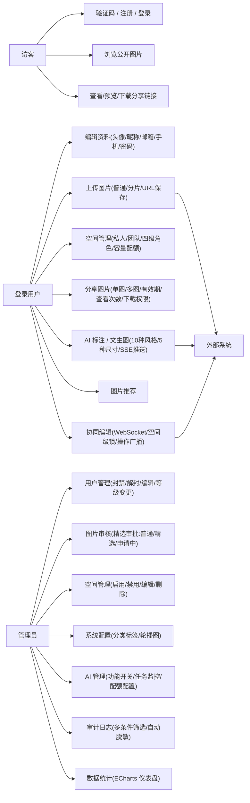
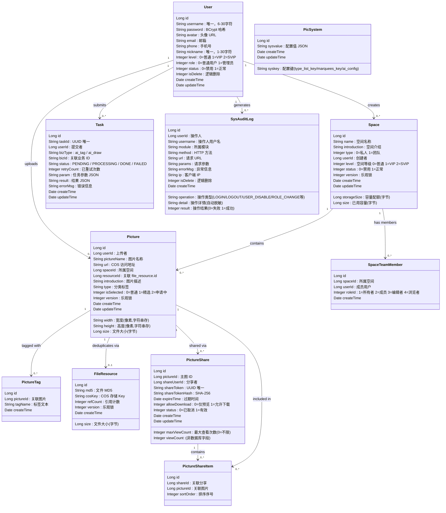
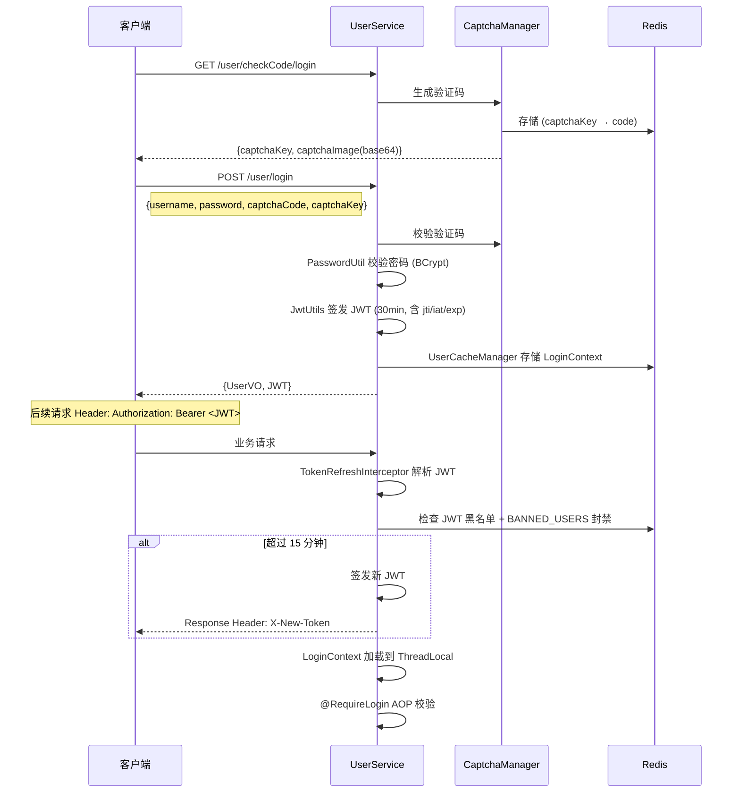
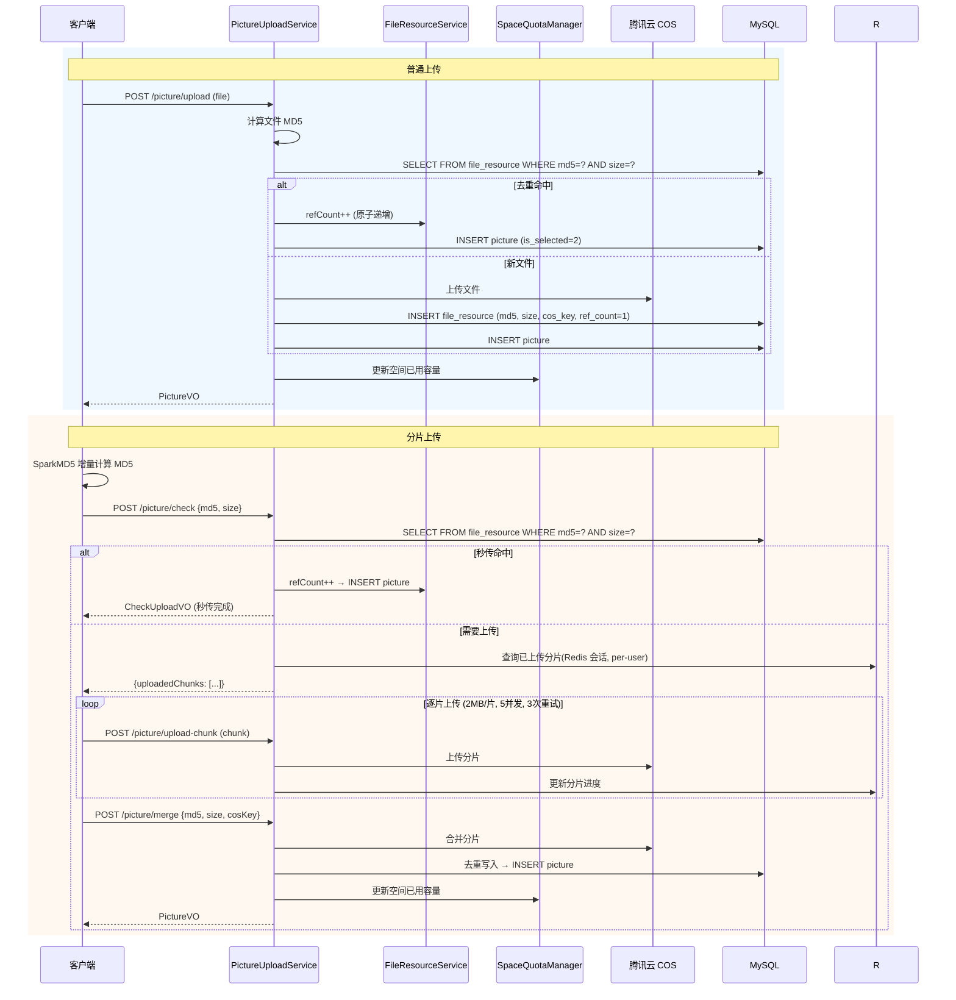
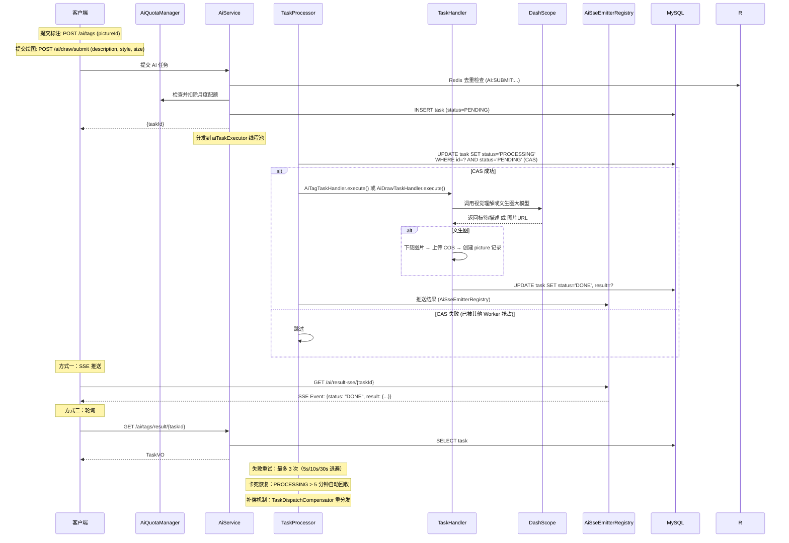
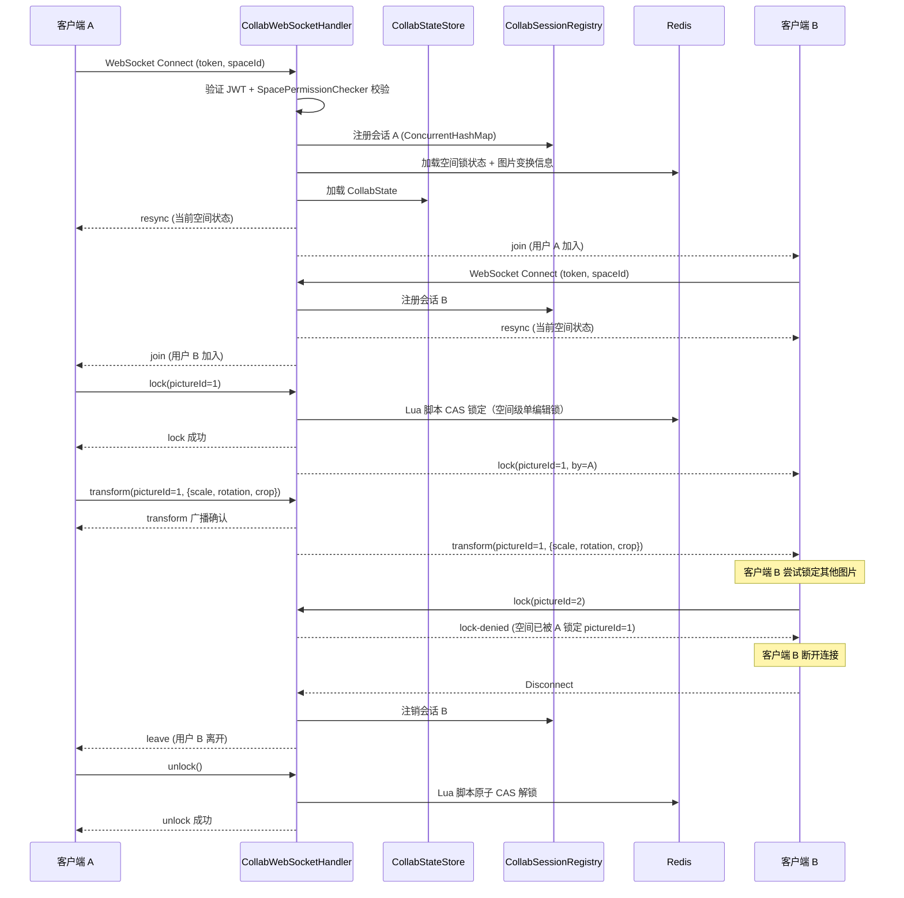
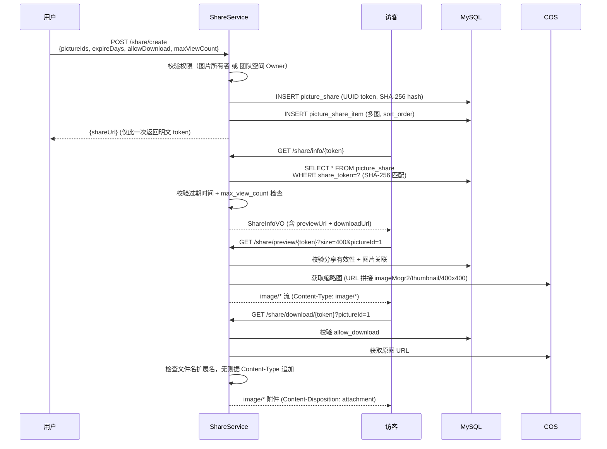

# UML 图与数据模型

> FishPics — AI 图片素材协作平台

## 目录

- [1. 用例模型](#1-用例模型)
- [2. 领域类图](#2-领域类图)
- [3. ER 图](#3-er-图)
- [4. 接口概览](#4-接口概览)
- [5. WebSocket 消息协议](#5-websocket-消息协议)
- [6. 时序图](#6-时序图)
- [7. 关键约束](#7-关键约束)

---

## 1. 用例模型

### 参与者

| 参与者 | 说明 | 权限范围 |
|--------|------|----------|
| **访客** | 未登录用户 | 验证码、注册、登录、浏览公开图片、查看 / 预览 / 下载分享链接 |
| **登录用户** | 已认证用户（level 0-2） | 资料维护、图片上传（普通/分片/URL保存）、编辑/删除、空间管理、分享（单图/多图）、AI 标注 / 文生图、图片推荐、协同编辑 |
| **管理员** | 管理员（role=1） | 全部用户功能 + 用户管理（封禁/编辑/等级变更）、图片审核、空间管理、AI 配置（功能开关/配额）、系统配置（分类标签/轮播图）、审计日志、数据统计 |
| **外部系统** | 第三方服务 | DashScope（AI：视觉理解大模型 + 文生图大模型）、腾讯云 COS（对象存储）、Redis（缓存/分布式锁/会话/SSE） |

### 用例图



### 用例说明

#### 访客用例

| 用例 | 前置条件 | 主流程 | 后置条件 |
|------|----------|--------|----------|
| 注册 | 无 | 获取验证码（register）→ 填写用户名（6-30字符）/ 密码（8-32字符）/ 验证码 → 提交 | 创建用户 + 自动创建私人空间 |
| 登录 | 已注册 | 获取验证码（login）→ 填写用户名 / 密码 / 验证码 → 提交（5次/60s限流） | 返回 JWT + UserVO |
| 浏览公开图片 | 无 | 进入首页 → 轮播图 → 分类标签筛选 → 瀑布流分页 / 搜索 | 无 |
| 查看分享链接 | 有分享链接 | 访问分享链接 → 校验 Token(SHA-256) + 过期 + 查看次数 → 预览缩略图（可选下载） | 无 |

#### 登录用户用例

| 用例 | 前置条件 | 主流程 | 后置条件 |
|------|----------|--------|----------|
| 上传图片（普通） | 已登录，有空间，未超容量/大小限制 | 选择文件 → 后端计算 MD5 → 查 file_resource 去重 → 未命中时上传 COS → 写 picture + 更新空间容量 | 创建 picture 记录（is_selected=2 申请中） |
| 上传图片（分片） | 已登录，大文件 | SparkMD5 增量计算 → check（秒传/续传校验）→ 逐片上传（2MB/片, 5并发, 3次重试）→ merge → 去重写入 | 创建 picture 记录 |
| 编辑图片 | 已登录，有图片 | 修改元数据（名称/标签/分类/描述）→ 在线裁剪（Cropper.js）→ 替换文件（协同场景广播通知） | 更新 picture 记录 |
| 空间管理 | 已登录 | 创建空间（按等级限制数量/容量）→ 管理图片 → 邀请成员（四级角色变更） | 空间成员数据更新 |
| 分享图片 | 已登录，有图片 | 选择图片（多图, sort_order 排序）→ 团队 Owner 可选空间内任意图片 → 配置有效期/查看次数/下载权限 → 生成链接（仅一次明文返回） | 创建 share + share_item 记录 |
| AI 标注 | 已登录，有配额，功能开启 | 选择图片 → Redis 去重（30s）→ 检查并扣除标注配额 → 提交异步任务 → SSE 等待结果 → 标签和描述写入 | 创建 task，标签写入 picture_tag |
| AI 文生图 | 已登录，有配额，功能开启 | 输入文本描述（≤500字符）→ 选择比例（5种）/ 风格（10种）→ Redis 去重（200s）→ 检查并扣除绘图配额 → 提交异步任务 → SSE 等待结果 → 生成图片自动上传 COS | 创建 task + 新 picture 记录 |
| 图片推荐 | 已登录，功能开启 | 浏览推荐图片列表（功能开关 `recommendationEnabled`） | 无 |
| 协同编辑 | 已登录，团队成员 | 进入团队空间 → WebSocket 连接（指数退避重连）→ 锁定图片（空间级单编辑锁）→ 实时操作广播（scale/rotation/crop）→ 解锁（Lua 原子 CAS） | WebSocket 实时同步 |

#### 管理员用例

| 用例 | 前置条件 | 主流程 | 后置条件 |
|------|----------|--------|----------|
| 图片审核 | 管理员身份 | 查看图片列表（多条件筛选）→ 精选审批（0=普通 1=精选 2=申请中） | 图片 is_selected 更新 |
| 用户管理 | 管理员身份 | 查看用户列表（分页/多条件筛选）→ 封禁 / 解封（不可禁用最后一名管理员）/ 编辑（等级/角色） | 用户状态更新（封禁即时失效 Token） |
| 空间管理 | 管理员身份 | 查看空间列表（分页）→ 编辑 / 删除 / 启用 / 禁用 | 空间状态更新 |
| 系统配置 | 管理员身份 | 管理分类标签（增删）→ 管理轮播图（增删）→ Redis 缓存自动失效 | 配置更新 |
| AI 配置 | 管理员身份 | 查看 AI 统计数据 → 开关标注/生图/协同编辑/推荐功能 → 配置月度配额（VIP/SVIP） | 配置更新 |
| 审计日志 | 管理员身份 | 查看审计日志列表（多条件筛选：操作类型/模块/用户/时间/IP） | 无 |
| 数据统计 | 管理员身份 | 查看系统统计数据（ECharts 可视化仪表盘：用户/图片/空间等汇总数据） | 无 |

---

## 2. 领域类图



### 类关系说明

| 关系 | 说明 |
|------|------|
| User → Space | 一个用户创建多个空间，私人空间一对一（uk_user_type 约束）；空间容量按 level 分配 |
| Space → Picture | 一个空间包含多张图片（通过 space_id 关联） |
| Picture → FileResource | 图片通过 resourceId 关联物理文件，`(md5, size)` 联合唯一实现去重共享 |
| Picture → PictureTag | 一张图片可有多个标签（独立表存储，`uk_picture_tag` 联合主键防重复） |
| Picture → PictureShare | 一张图片可生成多个分享链接；支持多图分享通过 PictureShareItem 中间表 |
| PictureShare → PictureShareItem | 分享链接可包含多张图片，sort_order 控制排序 |
| Space → SpaceTeamMember | 团队空间有多个成员（四级角色：OWNER/MEMBER/EDITOR/VIEWER） |
| User → Task | 用户提交多个 AI 任务（ai_tag / ai_draw），异步处理 |

---

## 3. ER 图

```mermaid
erDiagram
    USER ||--o{ SPACE : "creates"
    USER ||--o{ PICTURE : "uploads"
    USER ||--o{ TASK : "submits"
    USER ||--o{ SYS_AUDIT_LOG : "generates"
    SPACE ||--o{ PICTURE : "stores"
    SPACE ||--o{ SPACE_TEAM_MEMBER : "has_members"
    PICTURE ||--o{ PICTURE_TAG : "tagged_with"
    PICTURE ||--o| FILE_RESOURCE : "deduplicates_via"
    PICTURE ||--o{ PICTURE_SHARE : "shared_via"
    PICTURE_SHARE ||--o{ PICTURE_SHARE_ITEM : "contains"
    PICTURE ||--o{ PICTURE_SHARE_ITEM : "included_in"

    USER {
        bigint id PK
        varchar username UK "用户名(登录用)"
        varchar password "BCrypt 哈希"
        varchar avatar "头像 URL"
        varchar email "邮箱"
        varchar phone "手机号"
        varchar nickname UK "昵称(展示用)"
        tinyint level "0=普通 1=VIP 2=SVIP"
        tinyint role "0=普通用户 1=管理员"
        tinyint status "0=禁用 1=正常"
        tinyint is_delete "逻辑删除 0=否 1=是"
        datetime create_time
        datetime update_time
    }

    SPACE {
        bigint id PK
        varchar name "空间名称"
        varchar introduction "空间介绍"
        tinyint type "0=私人空间 1=团队空间"
        bigint user_id FK "创建者"
        bigint storage_size "容量配额(字节)"
        bigint size "已用容量(字节)"
        tinyint level "空间等级 0=普通 1=VIP 2=SVIP"
        tinyint status "0=禁用 1=正常"
        bigint version "乐观锁版本号"
        datetime create_time
        datetime update_time
        UK(user_id, type)
    }

    PICTURE {
        bigint id PK
        bigint user_id FK "上传者"
        varchar picture_name "图片名称"
        varchar url "COS 访问地址"
        varchar width "宽度(像素)"
        varchar height "高度(像素)"
        bigint size "文件大小(字节)"
        bigint space_id FK "所属空间"
        bigint resource_id FK "关联file_resource.id"
        varchar introduction "图片描述"
        varchar type "分类标签"
        tinyint is_selected "0=普通 1=精选 2=申请中"
        bigint version "乐观锁版本号"
        datetime create_time
        datetime update_time
        UK(resource_id, user_id, space_id)
    }

    PICTURE_TAG {
        bigint id PK
        bigint picture_id FK "关联图片"
        varchar tag_name "标签文本"
        datetime create_time
        UK(picture_id, tag_name)
    }

    FILE_RESOURCE {
        bigint id PK
        varchar md5 "文件 MD5"
        bigint size "文件大小(字节)"
        varchar cos_key "COS 存储 Key"
        int ref_count "引用计数"
        bigint version "乐观锁版本号"
        datetime create_time
        UK(md5, size)
        CHECK(ref_count >= 0)
    }

    PICTURE_SHARE {
        bigint id PK
        bigint picture_id FK "主图 ID"
        bigint share_user_id FK "分享者"
        varchar share_token UK "UUID Token(明文)"
        varchar share_token_hash "SHA-256 哈希"
        datetime expire_time "过期时间"
        tinyint allow_download "0=仅预览 1=允许下载"
        int max_view_count "最大访问次数(0=不限)"
        tinyint status "0=已取消 1=有效"
        datetime create_time
        datetime update_time
    }

    PICTURE_SHARE_ITEM {
        bigint id PK
        bigint share_id FK "关联分享"
        bigint picture_id FK "关联图片"
        int sort_order "排序序号"
    }

    TASK {
        bigint id PK
        varchar task_id UK "UUID 任务唯一标识"
        bigint user_id FK "提交者"
        varchar biz_type "ai_tag / ai_draw"
        varchar biz_id "关联业务 ID"
        varchar status "PENDING / PROCESSING / DONE / FAILED"
        int retry_count "已重试次数"
        text param "任务参数 JSON"
        text result "结果 JSON"
        varchar error_msg "错误信息"
        datetime create_time
        datetime update_time
    }

    SPACE_TEAM_MEMBER {
        bigint id PK
        bigint space_id FK "所属空间"
        bigint user_id FK "成员用户"
        int role_id "1=所有者 2=成员 3=编辑者 4=浏览者"
        datetime create_time
        UK(space_id, user_id)
    }

    PIC_SYSTEM {
        bigint id PK
        varchar syskey UK "配置键(type_list_key/marquees_key/ai_config)"
        text sysvalue "配置值(JSON)"
        datetime create_time
        datetime update_time
    }

    SYS_AUDIT_LOG {
        bigint id PK
        bigint user_id FK "操作人"
        varchar username "操作人用户名"
        varchar operation "操作类型"
        varchar module "所属模块"
        text detail "操作详情(自动脱敏)"
        varchar method "HTTP 方法"
        varchar url "请求 URL"
        text params "请求参数"
        tinyint result "操作结果(0=失败 1=成功)"
        text error_msg "异常信息"
        varchar ip "客户端 IP"
        tinyint is_delete "逻辑删除 0=否 1=是"
        datetime create_time
    }
```

### 表说明

| 表 | 记录数预期 | 核心索引 | 说明 |
|----|-----------|----------|------|
| `user` | 千级 | `username` UK, `nickname` UK | 用户账户（含逻辑删除） |
| `space` | 千级 | `(user_id, type)` UK, `type` IDX | 空间（私人 + 团队，容量配额） |
| `picture` | 万~十万级 | `space_id` IDX, `user_id` IDX, `is_selected` IDX, `update_time` IDX, `(resource_id, user_id, space_id)` UK | 图片记录（无 status/is_private 字段，精选通过 is_selected 管理） |
| `picture_tag` | 十万级 | `(picture_id, tag_name)` UK, `tag_name` IDX | 图片标签关联 |
| `file_resource` | 万级 | `(md5, size)` UK | 物理文件去重（`ref_count >= 0` CHECK 约束） |
| `picture_share` | 千级 | `share_token` UK, `share_token_hash` IDX, `expire_time` IDX | 分享链接（明文 Token + SHA-256 哈希双存） |
| `picture_share_item` | 千级 | `share_id` IDX, `picture_id` IDX | 多图分享关联（sort_order 排序） |
| `task` | 千级 | `task_id` UK, `status` IDX, `biz_type` IDX, `user_id` IDX | AI 异步任务 |
| `space_team_member` | 千级 | `(space_id, user_id)` UK | 团队成员（四级角色） |
| `pic_system` | 十级 | `syskey` UK | 系统键值配置（键值对模式，值存 JSON） |
| `sys_audit_log` | 万级 | `user_id` IDX, `create_time` IDX, `operation` IDX | 审计日志（含逻辑删除，结果 0/1） |

---

## 4. 接口概览

所有 REST 接口前缀 `/api`，统一响应格式 `Response<T>`（code=1 成功，其他为错误码）。详细参数和返回值参见 Knife4j 文档（启动后访问 `/api/doc.html`）。

### 用户模块 — UserController（路径前缀：`/user`）

| 方法 | 路径 | 认证 | 说明 |
|------|------|------|------|
| GET | `/checkCode/login` | 无 | 获取登录验证码 |
| GET | `/checkCode/register` | 无 | 获取注册验证码 |
| POST | `/register` | 无（限流 3次/300s） | 用户注册（含自动创建私人空间） |
| POST | `/login` | 无（限流 5次/60s） | 用户登录 |
| GET | `/myself` | @RequireLogin | 获取当前用户基本信息 |
| GET | `/getUser` | @RequireLogin | 获取当前用户完整信息（含权限） |
| POST | `/editUser` | @RequireLogin | 编辑个人资料（改密码返回 X-New-Token） |
| POST | `/logout` | @RequireLogin + @AuditLog | 退出登录 |
| GET | `/profile` | @RequireLogin | 查看指定用户资料 |
| GET | `/search` | @RequireLogin | 搜索用户（按用户名模糊） |
| POST | `/admin/getUser` | @RequireAdmin | 管理端：获取用户详情 |
| POST | `/admin/getUserDetail` | @RequireAdmin | 管理端：获取用户完整详情（含等级/角色） |
| POST | `/admin/userList` | @RequireAdmin | 管理端：用户列表（分页/多条件） |
| POST | `/admin/setStatus` | @RequireAdmin + @AuditLog | 管理端：封禁 / 解封用户 |
| POST | `/admin/editUser` | @RequireAdmin + @AuditLog | 管理端：编辑用户（等级/角色/信息） |

### 图片模块 — PictureController（路径前缀：`/picture`）

| 方法 | 路径 | 认证 | 说明 |
|------|------|------|------|
| POST | `/upload` | @RequireLogin + @AuditLog | 上传图片（普通单文件，自动 MD5 去重） |
| POST | `/avatar` | @RequireLogin + @AuditLog | 上传头像（支持管理员代传） |
| POST | `/save-by-url` | @RequireLogin | URL 保存图片 |
| POST | `/check` | @RequireLogin | 分片上传：秒传 / 续传校验 |
| POST | `/upload-chunk` | @RequireLogin | 分片上传：上传单个分片 |
| POST | `/merge` | @RequireLogin | 分片上传：合并分片 |
| POST | `/list` | 无 | 公开图片列表（分页 + 分类筛选 + 搜索） |
| POST | `/recommend` | @RequireLogin | AI 推荐图片 |
| POST | `/delete` | @RequireLogin + @AuditLog | 删除图片（单张 / 批量） |
| PUT | `/update` | @RequireLogin + @AuditLog | 编辑图片元数据（名称/标签/分类/描述） |
| POST | `/replace` | @RequireLogin | 替换图片文件（支持 collab 标记触发 WebSocket 通知） |
| GET | `/pictureEditMessage` | @RequireLogin | 获取图片编辑信息 |
| POST | `/admin/list` | @RequireAdmin | 管理端：图片列表 |
| POST | `/admin/review` | @RequireAdmin + @AuditLog | 管理端：精选审批（0=普通 1=精选 2=申请中） |

### 分享模块 — ShareController（路径前缀：`/share`）

| 方法 | 路径 | 认证 | 说明 |
|------|------|------|------|
| POST | `/create` | @RequireLogin + @AuditLog | 创建分享链接（支持多图，团队 Owner 可分享空间内任意图片） |
| GET | `/info/{token}` | 无 | 获取分享信息（SHA-256 匹配 + 校验过期 + 查看次数） |
| GET | `/preview/{token}` | 无 | 预览分享图片（支持 `size` 参数缩略图，COS imageMogr2 实时处理，仅返回 image/*） |
| GET | `/download/{token}` | 无 | 下载分享图片（需 allow_download，文件名自动追加扩展名） |
| POST | `/cancel` | @RequireLogin + @AuditLog | 取消分享 |

### 空间模块 — SpaceController（路径前缀：`/space`）

| 方法 | 路径 | 认证 | 说明 |
|------|------|------|------|
| POST | `/create` | @RequireLogin + @AuditLog | 创建空间（私人/团队，按等级限数量和容量） |
| GET | `/list` | @RequireLogin | 空间列表（按 type 筛选） |
| GET | `/getSpace` | @RequireLogin | 空间详情（Redis 缓存） |
| POST | `/update` | @RequireLogin + @AuditLog | 更新空间 |
| POST | `/pictureList` | @RequireLogin | 空间内图片列表（分页 + 权限校验） |
| GET | `/saveable` | @RequireLogin | 可保存图片的空间列表 |
| GET | `/team/members` | @RequireLogin | 团队成员列表 |
| POST | `/team/invite` | @RequireLogin + @AuditLog | 邀请成员 |
| POST | `/team/remove` | @RequireLogin + @AuditLog | 移除成员 |
| POST | `/team/changeRole` | @RequireLogin + @AuditLog | 变更成员角色（1/2/3/4） |
| POST | `/admin/list` | @RequireAdmin + @AuditLog | 管理端：空间列表（分页） |
| POST | `/admin/update` | @RequireAdmin + @AuditLog | 管理端：更新空间 |
| POST | `/admin/delete` | @RequireAdmin + @AuditLog | 管理端：删除空间 |
| POST | `/admin/setStatus` | @RequireAdmin + @AuditLog | 管理端：启用 / 禁用空间 |

### AI 模块 — AiController（路径前缀：`/ai`）

| 方法 | 路径 | 认证 | 说明 |
|------|------|------|------|
| POST | `/tags` | @RequireLogin | 提交 AI 标注任务（Redis 去重 30s，先扣配额） |
| GET | `/tags/result/{taskId}` | @RequireLogin | 查询标注结果 |
| POST | `/draw/submit` | @RequireLogin | 提交文生图任务（Redis 去重 200s，支持 10 种风格 + 5 种尺寸） |
| GET | `/draw/result/{taskId}` | @RequireLogin | 查询文生图结果 |
| GET | `/result-sse/{taskId}` | @RequireLogin | SSE 实时推送任务结果 |
| GET | `/download-image/{taskId}` | @RequireLogin | 下载 AI 生成图片（返回 COS URL） |
| POST | `/admin/tasks` | @RequireAdmin + @AuditLog | 管理端：AI 任务列表（分页，类型/状态筛选） |
| GET | `/admin/stats` | @RequireAdmin + @AuditLog | 管理端：AI 统计数据 |
| GET | `/admin/config` | @RequireAdmin + @AuditLog | 管理端：获取 AI 配置（功能开关 + 配额） |
| POST | `/admin/config` | @RequireAdmin + @AuditLog | 管理端：更新 AI 配置 |

### 系统模块 — SystemController + AuditLogController（路径前缀：`/system`）

| 方法 | 路径 | 认证 | 说明 |
|------|------|------|------|
| GET | `/list` | 无 | 获取图片分类标签列表（Redis 缓存） |
| POST | `/addList` | @RequireAdmin + @AuditLog | 管理端：添加分类标签 |
| POST | `/deleteType` | @RequireAdmin + @AuditLog | 管理端：删除分类标签 |
| GET | `/marquee` | 无 | 获取轮播图列表 |
| POST | `/addMarquee` | @RequireAdmin + @AuditLog | 管理端：添加轮播图 |
| POST | `/deleteMarquee` | @RequireAdmin + @AuditLog | 管理端：删除轮播图 |
| POST | `/audit-log/list` | @RequireAdmin | 管理端：审计日志列表（分页，多条件筛选） |
| GET | `/stats` | @RequireAdmin | 管理端：系统统计数据 |

### WebSocket

| 路径 | 认证 | 说明 |
|------|------|------|
| `/api/ws/collab?token=<JWT>&spaceId=<id>` | JWT（连接时验证） + SpacePermissionChecker | 实时协同编辑 |

## 5. WebSocket 消息协议

### 消息类型

| 类型 | 方向 | 说明 |
|------|------|------|
| `join` | 客户端 → 服务端 | 加入空间编辑会话 |
| `leave` | 客户端 → 服务端 | 离开空间编辑会话 |
| `presence` | 服务端 → 客户端 | 当前在线用户列表 |
| `lock` | 客户端 → 服务端 → 全体 | 锁定图片（空间级单编辑锁，Lua 脚本原子操作） |
| `unlock` | 客户端 → 服务端 → 全体 | 释放图片锁 |
| `lock-denied` | 服务端 → 客户端 | 锁定被拒绝（空间已有其他图片被锁定） |
| `transform` | 客户端 → 服务端 → 全体 | 图片变换操作（scale, rotation, crop） |
| `file-replaced` | 客户端 → 服务端 → 全体 | 图片文件已替换 |
| `resync` | 服务端 → 客户端 | 重连后同步当前空间状态（锁信息 + 变换信息） |

### 前端 WebSocket 实现

- 连接：`ws[s]://host/api/ws/collab?spaceId=<id>&token=<JWT>`
- 自动连接：mount 后 150ms 延迟
- 断线重连：指数退避 1s → 2s → 4s → 8s → ... → 最大 30s，最多 10 次
- 正常关闭（code 1000）不重连；`visibilitychange` 可见性恢复时自动检测重连
- unmount 时 close(1000) 并记录到 WeakSet 避免重复连接

---

## 6. 时序图

### 6.1 登录流程



### 6.2 图片上传流程



### 6.3 AI 任务流程



### 6.4 协同编辑流程



### 6.5 分享流程



---

## 7. 关键约束

### 唯一约束

| 表 | 约束 | 说明 |
|-----|------|------|
| `user` | `username` UNIQUE | 用户名全局唯一 |
| `user` | `nickname` UNIQUE | 昵称全局唯一 |
| `file_resource` | `(md5, size)` UNIQUE | 同一大小 + MD5 的文件只存一份 |
| `space` | `(user_id, type)` UNIQUE | 每用户每类型空间唯一（私人空间只有一个） |
| `space_team_member` | `(space_id, user_id)` UNIQUE | 一个用户在一个空间只能有一个角色 |
| `picture` | `(resource_id, user_id, space_id)` UNIQUE | 同一空间内同一文件资源唯一 |
| `task` | `task_id` UNIQUE | 任务 ID 全局唯一 |
| `picture_share` | `share_token` UNIQUE | 分享 Token 全局唯一 |
| `pic_system` | `syskey` UNIQUE | 系统配置键唯一 |
| `picture_tag` | `(picture_id, tag_name)` UNIQUE | 一张图片不能重复添加相同标签 |

### 业务约束

| 约束 | 说明 |
|------|------|
| `file_resource.ref_count >= 0` | 引用计数不能为负（CHECK 约束） |
| 私人空间唯一 | 每个用户有且仅有一个私人空间（type=0，`uk_user_type` 约束） |
| 空间容量按等级 | 个人空间 1/5/10 GB，团队空间 5/10/20 GB（SpaceConstants 控制） |
| 上传大小按等级 | 普通 10 MB / VIP 50 MB / SVIP 100 MB（前后端双重校验） |
| 团队空间数按等级 | level 0=1 / level 1=3 / level 2=5（SpaceConstants 控制） |
| 管理员保护 | 禁止禁用最后一名管理员（UserServiceImpl.setStatus() 校验） |
| 图片审核 | 上传后默认 `is_selected=2`（申请中），管理员审批后改为 0（普通）或 1（精选） |
| 分享权限 | 只能分享自己的图片或所在团队空间 Owner 身份的图片 |
| 分享免登录 | `/share/info/*`, `/share/preview/*`, `/share/download/*` 无需认证 |
| 分享防 XSS | 仅返回 `image/*` Content-Type |
| 分享缩略图 | 预览接口支持 `size` 参数，通过 COS imageMogr2 实时生成 |
| 分享下载扩展名 | 下载文件名无扩展名时根据 Content-Type 自动追加 |
| 分享 Token 安全 | 创建时仅返回一次明文，库中存 SHA-256 哈希 |
| 审计日志脱敏 | 自动过滤 `password`、`token`、`apiKey`、`secret` 等字段 |
| 乐观锁 | `space`、`file_resource`、`picture` 表使用 version 字段防并发写入 |
| 空间级单编辑锁 | 同一空间同时只允许编辑一张图片（Redis Lua 脚本原子 CAS 锁定） |
| AI 月度配额 | 标注和生图分别配额，按用户等级分配（Redis 原子计数，任务提交前先扣后做） |
| AI 去重防刷 | 标注 30s / 绘图 200s Redis 去重，重复提交自动 refund 配额 |
| AI 功能开关 | 标注 / 生图 / 协同编辑 / 推荐四项能力可独立开关（pic_system.ai_config 配置） |
| 分片上传隔离 | Redis 会话键按 `userId:md5` 隔离，防止用户间 session 串号 |
| 注册自动建空间 | 注册事务中自动创建私人空间 |
| 修改密码失效 | 修改密码后 `USER_TOKEN_INVALID_BEFORE` 使所有旧 Token 失效 |
